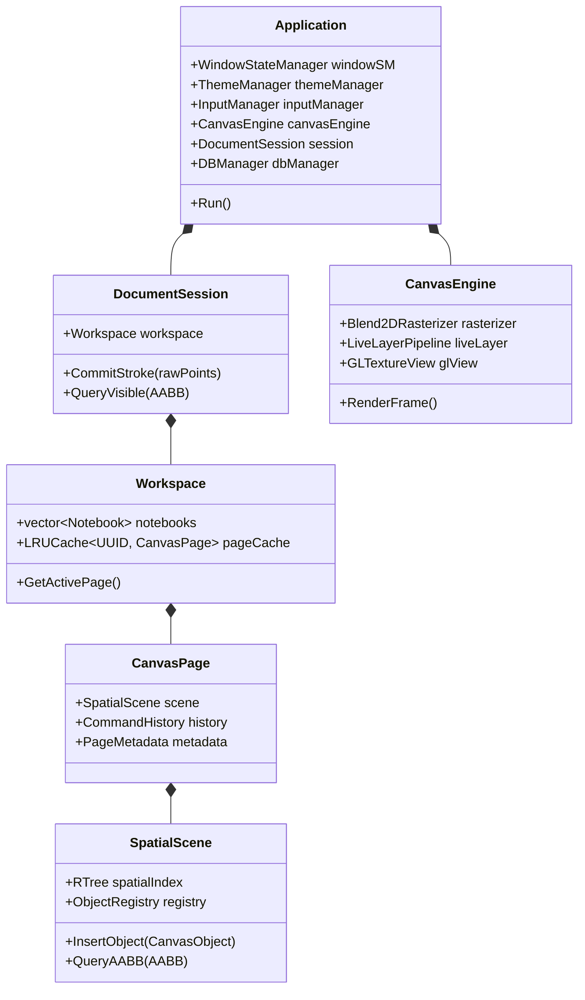

# Runtime Component Graph

This page describes the ownership model, runtime object graph, and memory lifecycles across the FolioNote engine subsystems.

---

## 🏛️ Subsystem Ownership Hierarchy

The runtime enforces clear, single-owner hierarchies using modern C++ RAII semantics and smart pointers (`std::unique_ptr` for exclusive ownership, `std::shared_ptr` for shared resource caches).

---

## 🧠 Memory & Lifetime Rules

1. **`Application` Lifecycle:** Owns global infrastructure: SDL3 context, OpenGL state, database connection handles, and primary dispatch loops.
2. **`DocumentSession` (Single Source of Truth):** Owns active working sets, undo/redo command stacks, and document mutation transactions.
3. **`SpatialScene` (Decoupled Indexing):** 
    - The `RTree` contains only lightweight spatial keys: an `AABB` bounding box and a 32-bit `UID`.
    - The `ObjectRegistry` stores the heap geometry via `std::shared_ptr<CanvasObject>`.
    - Fast spatial queries iterate through the lightweight R-Tree cache lines without dereferencing vector point buffers.
4. **`CanvasEngine` (Transient State):** Owns image buffers and hardware textures. It reads from `SpatialScene` without holding persistent ownership of geometry data.
