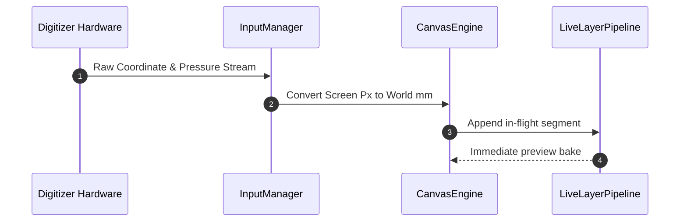
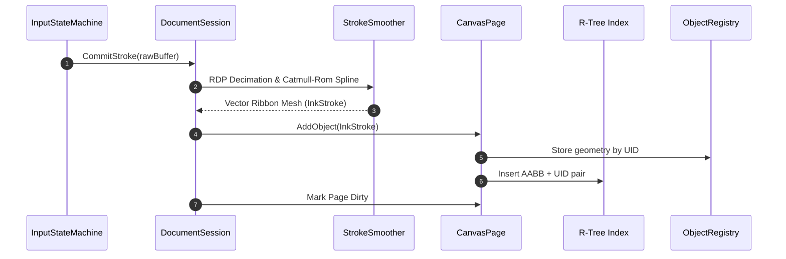
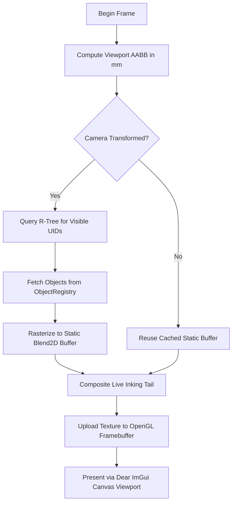
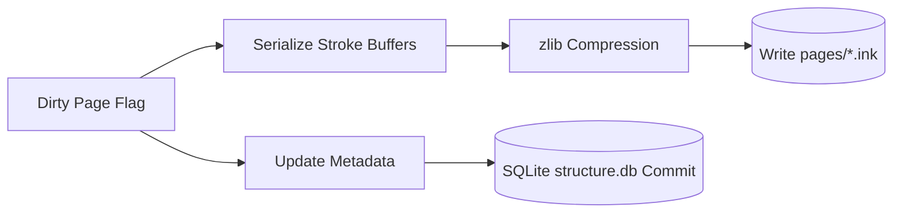

# Data Flow & Execution Passes

FolioNote separates runtime execution into four asynchronous, decoupled pipelines to ensure that input polling, canvas rasterization, and disk I/O never stall one another.

---

## 1. Live Inking Pipeline (480 Hz Input Polling)

Digitizer hardware events bypass the main scene rasterizer to deliver zero-latency visual feedback on active strokes.

---

## 2. Stroke Committal Pipeline (Pen Lift)

When the pen lifts from the screen, the temporary stroke converts into a permanent, indexed vector object.

---

## 3. Frame Render Pipeline (Display Refresh)

The render loop dynamically composites static content with active live strokes.

---

## 4. Background Persistence Pipeline

Disk writes occur off the main UI and rendering threads using asynchronous worker pools.

