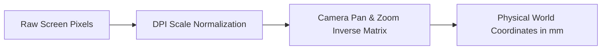

# Input Pipeline & Event Arbitration

The input pipeline ingests continuous hardware telemetry, translates screen coordinates to world millimeters, and arbitrates interaction priorities between active styluses, multi-touch gestures, and desktop mice.

---

## 🎯 Priority Arbitration & Palm Rejection

Input events from SDL3 are evaluated by a priority state machine to reject unintentional palm contact during writing.

```mermaid
flowchart TD
    A[SDL3 Event Stream] --> B{Event Type}
    
    B -->|Pen Touch / Proximity| C[Active Stylus Mode]
    B -->|Finger Touch| D{Stylus Active?}
    B -->|Mouse / Keyboard| E[Desktop Fallback Mode]
    
    C --> F[Lock Inking Pipeline]
    C --> G[Suppress Multi-Touch Events]
    
    D -- Yes --> H[Drop Event (Palm Rejection)]
    D -- No --> I[Route to TouchGestureRecognizer]
    
    I --> J[Pinch-to-Zoom & Two-Finger Pan]
    E --> K[UI Interaction & Window Navigation]
```

---

## 📐 Coordinate Normalization

Digitizer coordinates arrive in integer window pixels and undergo affine transformation into continuous, high-precision physical world units:



* **Physical Units:** All vector strokes, geometry bounds, and spatial tree entries are calculated in millimeters ($mm$).
* **Zoom Independence:** Zooming does not alter stroke coordinate definitions; the transformation matrix scales the projection dynamically during rasterization.
