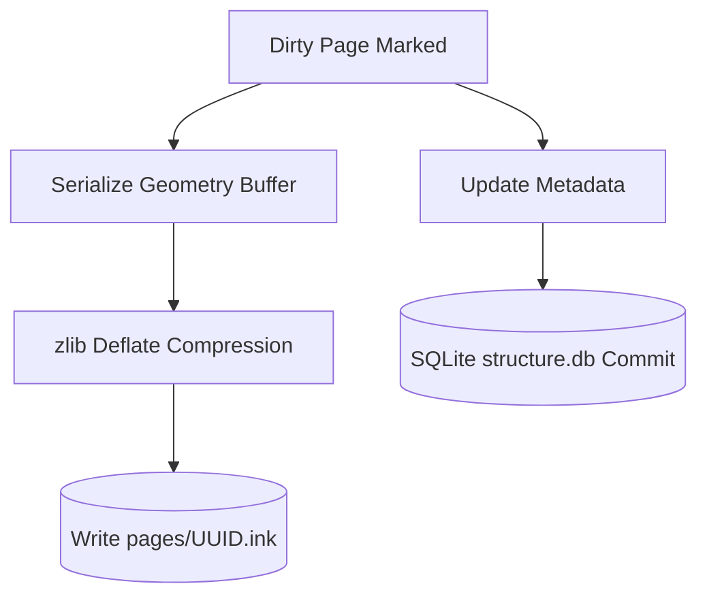

# Storage Model & Persistence

FolioNote uses a hybrid, local-first storage model. Notebooks exist as standard filesystem directory bundles (`.notebook`) combining relational SQLite metadata with compressed binary stroke streams.

---

## 📦 Package Bundle Structure (`.notebook`)

Each notebook is a self-contained directory on the file system:

```text
MyClassNotes.notebook/
├── structure.db                 # SQLite 3: Hierarchy, tags, titles, sorting
└── pages/
    ├── a1b2c3d4-0001.ink        # Compressed binary vector geometry
    ├── a1b2c3d4-0002.ink
    └── assets/
        └── img_991823.png       # Embedded canvas images and PDF cache
```

---

## 🗄️ Relational Metadata (`structure.db`)

SQLite is used exclusively for structural queries, section hierarchies, search indexing, and page ordering.

### Schema Blueprint

```sql
CREATE TABLE sections (
    id TEXT PRIMARY KEY,          -- UUID v4
    title TEXT NOT NULL,
    sort_order INTEGER NOT NULL,
    created_at INTEGER NOT NULL
);

CREATE TABLE pages (
    id TEXT PRIMARY KEY,          -- UUID v4 (maps to pages/<id>.ink)
    section_id TEXT NOT NULL,
    title TEXT NOT NULL,
    sort_order INTEGER NOT NULL,
    is_favorite INTEGER DEFAULT 0,
    created_at INTEGER NOT NULL,
    updated_at INTEGER NOT NULL,
    FOREIGN KEY(section_id) REFERENCES sections(id) ON DELETE CASCADE
);
```

---

## 📄 Compressed Binary Geometry (`.ink`)

Individual canvas pages store stroke coordinates, pressure arrays, and text objects inside high-density binary files compressed with `zlib`.

* **Header:** Magic bytes (`INK\0`), format version, and bounding box extents.
* **Payload:** Packed coordinate floats, pressure bytes ($[0, 255]$), color keys, and spatial node definitions.
* **Asynchronous I/O:** Serializing and flushing `.ink` files occurs on background thread pool workers, preventing main-thread stutter during continuous writing.

---

## 🔄 Persistence Pipeline



