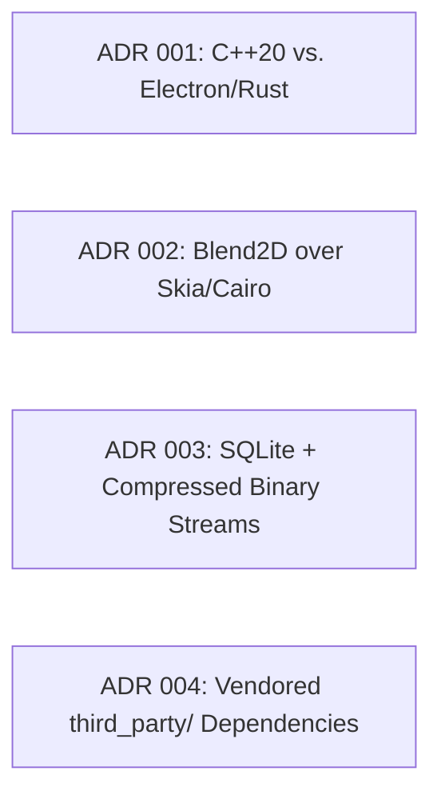

# Architectural Decision Records (ADRs)

Key architectural choices, rejected alternatives, and trade-offs made during the development of FolioNote.

---

## 📑 Decision Index

---

## ADR 001: Core Language Selection (C++20)

* **Context:** A fluid infinite-canvas note engine requires 120+ FPS sustained framerates and sub-5ms stylus latency with 480 Hz polling.
* **Decision:** Implement the entire engine core in native modern **C++20**.
* **Rationale:**
    * Eliminates Garbage Collection (GC) pauses inherent in managed runtimes (Electron/WebTech/JVM).
    * Provides zero-cost abstractions (`std::span`, `std::ranges`) and native SIMD alignment.
    * Unifies desktop (SDL3/OpenGL) and tablet targets (Android NDK) under a single shared codebase.

---

## ADR 002: Vector Rasterization Engine (Blend2D)

* **Context:** Need a high-performance 2D vector pipeline for anti-aliased bezier strokes, join capping, and dynamic polygon fills.
* **Options Considered:** Skia, Cairo, NanoVG, Blend2D.
* **Decision:** Choose **Blend2D**.
* **Rationale:**
    * **JIT Pipeline:** Compiles vectorized rasterization pipelines dynamically using AsmJit.
    * **Lightweight Footprint:** Highly modular without massive dependencies or heavy build overhead compared to Skia.
    * **Multi-threading:** Native parallel multi-threaded rendering context out of the box.

---

## ADR 003: Hybrid Storage Model (`.notebook` Bundle)

* **Context:** Infinite canvases generate tens of thousands of vector point arrays. Relational queries (search, page hierarchies) must coexist with high-bandwidth stroke reads.
* **Decision:** Adopt a hybrid storage architecture combining **SQLite3** for metadata and compressed **`.ink`** binary streams for geometric data.
* **Rationale:**
    * Relational metadata (notebooks, sections, pages, tags, full-text search) lives in SQLite with `FTS5` and `JSON1`.
    * Raw high-frequency stroke coordinates are serialized to compact, zlib-compressed binary blocks to minimize transaction overhead and file bloat.

---

## ADR 004: Vendored `third_party/` Submodules

* **Context:** Building across disparate platforms (MSVC, GCC, Clang, Android NDK) frequently breaks when relying on external system package managers (`vcpkg`, `conan`, `apt`).
* **Decision:** Vendor core dependencies (`SDL3`, `Blend2D`, `lunasvg`, `ink-stroke-modeler`, `imgui`, `sqlite3`) directly in the source repository under `third_party/`.
* **Rationale:**
    * Eliminates dependency resolution failures in offline builds or fresh CI worker environments.
    * Guarantees identical binary compatibility, compiler definitions, and patch stability across all deployment targets.
