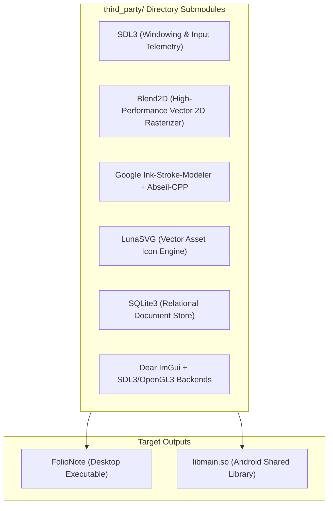
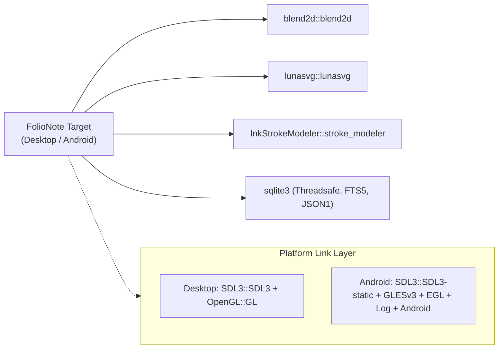

# Build System & Compilation Guide

FolioNote uses modern **CMake (>= 3.22)** to configure, link, and compile the C++20 engine across desktop targets and Android mobile hardware.

---

## 📦 Dependency Architecture

All external dependencies are vendored directly inside the `third_party/` directory to guarantee reproducible builds without system package drift:



---

## 🛠️ Toolchain Prerequisites

| Target Platform | Compiler Requirement | Build Driver | Notes |
|---|---|---|---|
| **Windows** | `MSVC 19.30+` (Visual Studio 2022) | `Ninja` or `MSBuild` | `/FS` and `CMAKE_OBJECT_PATH_MAX` configured for long paths |
| **Linux** | `GCC >= 12` or `Clang >= 15` | `Ninja` | Requires `OpenGL` and X11/Wayland dev headers |
| **macOS** | `Apple Clang >= 15` | `Ninja` | Native Metal/OpenGL context support |
| **Android** | `Android NDK r25+` | `Gradle` | Compiles into `libmain.so` with `GLESv3` and `EGL` |

---

## 🖥️ Desktop Build Instructions (Linux, macOS, Windows)

### 1. Clone the Repository (with Submodules)

Ensure all third-party submodules are cloned recursively:

```bash
git clone --recursive [https://github.com/3dwonderguy/FolioNote.git](https://github.com/3dwonderguy/FolioNote.git)
cd FolioNote
```

If already cloned without submodules:
```bash
git submodule update --init --recursive
```

### 2. Configure with CMake

```bash
cmake -B build \
  -G Ninja \
  -DCMAKE_BUILD_TYPE=Release
```

### 3. Compile

```bash
cmake --build build --config Release -j$(nproc)
```

The output binary is placed in `build/bin/`:
* **Executable:** `build/bin/FolioNote`
* **Assets:** Automatically mirrored to `build/bin/assets/` via CMake post-build commands.

---

## 📱 Android Compilation (`libmain.so`)

When targeting Android, CMake pivots from an executable to a shared dynamic library target (`add_library(main SHARED ...)`):

* **Target Output:** `libmain.so` (required by `SDLActivity` for `dlsym` dynamic symbol discovery).
* **Render Backend:** Disables desktop OpenGL and links `GLESv3`, `EGL`, `android`, and `log` with the `IMGUI_IMPL_OPENGL_ES3` definition.
* **Symbol Visibility:** Forces `C_VISIBILITY_PRESET default` and `CXX_VISIBILITY_PRESET default`.

### Building via Gradle / Android Studio

1. Open the project root or `/android-project` inside **Android Studio**.
2. Verify your `local.properties` specifies the Android SDK and NDK paths:
   ```properties
   sdk.dir=/path/to/Android/Sdk
   ndk.dir=/path/to/Android/Sdk/ndk/25.x.x
   ```
3. Assemble the build:
   ```bash
   ./gradlew assembleRelease
   ```

---

## ⚙️ Target Link Graph


