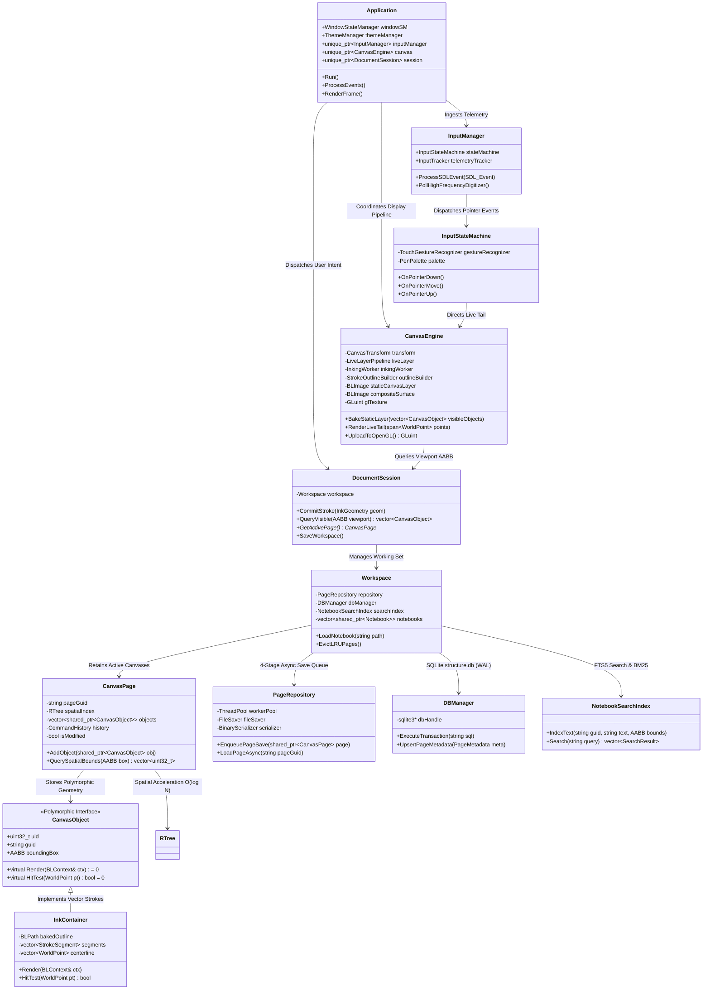
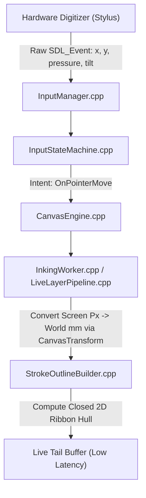
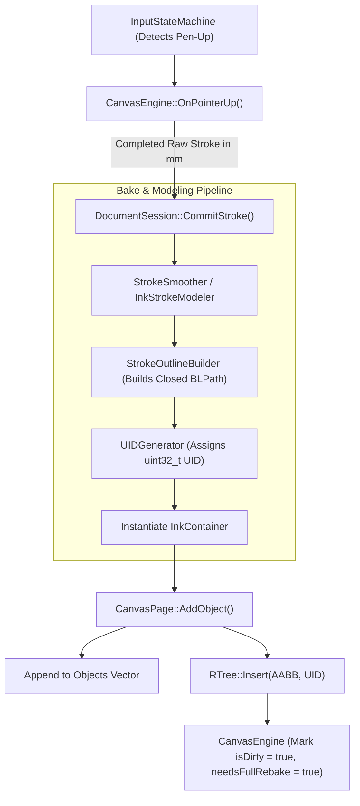
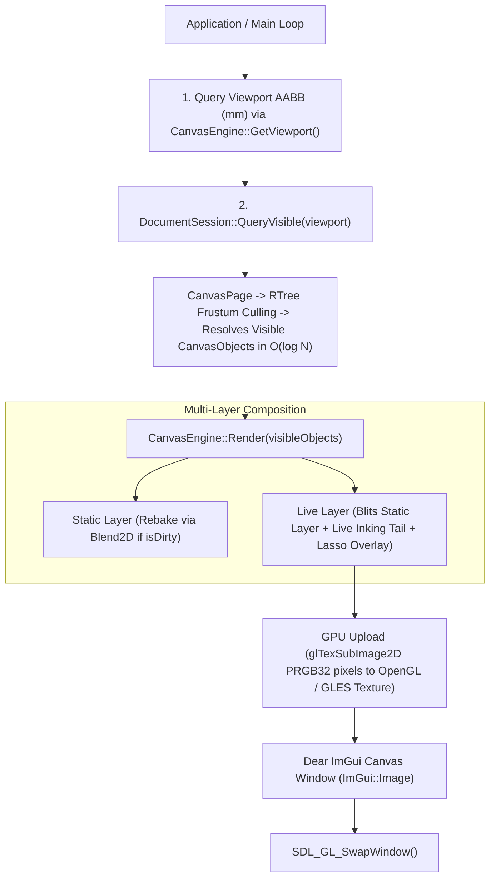
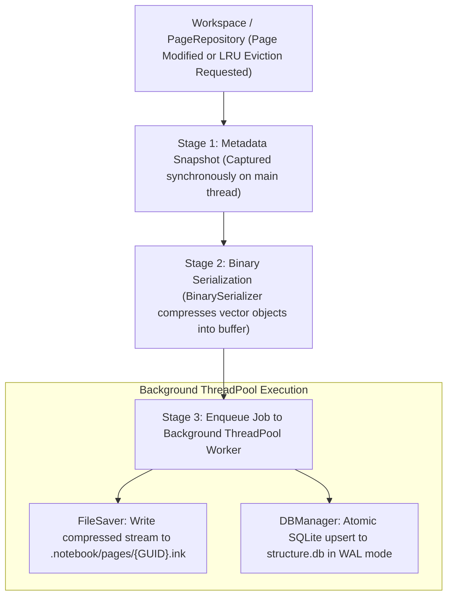
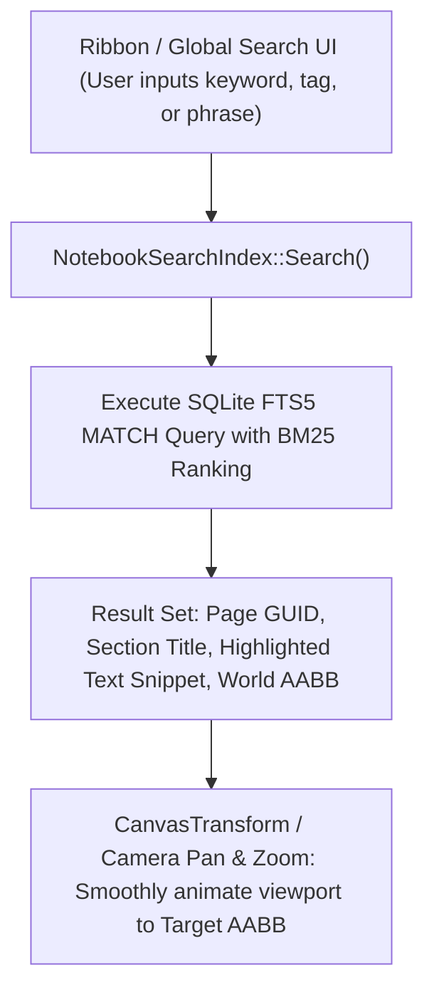

# Detailed Codebase Structure & Runtime Component Graph

This document provides a comprehensive map of FolioNote’s architectural layout, source directory responsibilities, class dependency hierarchy, and cross-subsystem execution lifecycles.

---

## 🏗️ Architectural Class & Component Graph

The engine enforces strict unidirectional data and control flow. High-level windowing and user interface layers interface exclusively through domain session facades, which coordinate geometry processing, spatial indexing, multi-threaded rendering, and asynchronous persistence.



---

## 📂 Source Code Layout & Responsibilities

```text
FolioNote/
├── CMakeLists.txt                      # C++20, SDL3, Blend2D, ImGui, LunaSVG, SQLite3, Google Ink Stroke Modeler
├── assets/
│   └── icons/                          # SVG tool & navigation icons
│       ├── Navigation/                 # arrow-left.svg, arrow-right.svg
│       └── Sections_Notebooks/         # Color-coded notebook & section SVG icons
├── config/
│   └── theme_custom.json               # Exported/imported runtime theme configurations
├── third_party/
│   ├── SDL/                            # SDL3 core + OpenGL / GLES bindings
│   ├── blend2d/                        # 2D vector software rasterizer (JIT-accelerated)
│   ├── imgui/                          # Dear ImGui core + SDL3 / OpenGL3 / GLES3 backends
│   ├── lunasvg/                        # Vector icon rendering engine
│   ├── sqlite3/                        # Embedded metadata & FTS5 search storage engine
│   ├── ink-stroke-modeler/             # Google Ink Stroke Modeler (predictive & physical stroke smoothing)
│   ├── abseil-cpp/                     # Abseil C++ baseline library (required by ink-stroke-modeler)
│   ├── asmjit/                         # Just-in-time machine code generation for Blend2D
│   ├── SDL_image/                      # Image loading backend for textures/bitmaps
│   └── freetype/                       # Font rasterization engine
└── src/
    ├── main.cpp                        # Entry point: bootstrap runtime, engine init, main loop
    │
    ├── android-project/                # Android NDK / Gradle deployment package
    │   ├── app/                        # Android application module (Java SDLActivity, JNI, Manifest)
    │   └── gradle/                     # Gradle wrapper configuration
    │
    ├── app/                            # Top-level application coordinator
    │   ├── app.hpp                     # Owns window, GL context, sessions, 120Hz frame pacing, layout orchestration
    │   ├── theme_manager.hpp           # Runtime theme palette loader & JSON parser (Dark/Light/Custom)
    │   └── window_state_manager.hpp    # Window state, DPI scale events, frame pacing, freeze gate (Intel Arc mitigation)
    │
    ├── core/
    │   ├── spatial/                    # Pure spatial math & acceleration indices
    │   │   ├── aabb.hpp                # Axis-Aligned Bounding Box math (World Millimeters)
    │   │   ├── r_tree.hpp / .cpp       # Dynamic R-Tree spatial index for O(log N) viewport culling & hit-testing
    │   │   └── undo_redo_manager.hpp   # Spatial command / undo-redo manager
    │   │
    │   ├── objects/                    # Domain objects (Geometry payloads & bounds)
    │   │   ├── canvas_object.hpp       # Base polymorphic interface (UID, GUID, Type, Bounds, Transform, Flags)
    │   │   ├── ink_container.hpp       # Baked vector ink strokes (closed polygon hulls, centerline, hit-testing)
    │   │   ├── text_box.hpp            # Text container, formatting, caret layout, spatial bounds
    │   │   └── image_object.hpp        # Embedded image frame referencing GPU textures
    │   │
    │   ├── document/                   # Document hierarchy & session management
    │   │   ├── document_session.hpp    # Controller facade: routes stroke committals, queries, and active page
    │   │   ├── canvas_page.hpp         # Infinite canvas unit (owns R-Tree + Object list + History + Sub-pages + LRU cache)
    │   │   ├── section.hpp             # Group of canvas pages with sorting order and color tag
    │   │   ├── section_group.hpp       # Hierarchical folder structure for grouping sections and nested sub-groups
    │   │   ├── notebook.hpp            # Root container for sections, section groups, metadata, and .notebook package path
    │   │   └── workspace.hpp           # Working set manager tracking active notebooks, lazy loading, and LRU eviction
    │   │
    │   ├── engine/                     # Low-level rasterization & transform pipeline
    │   │   ├── canvas_engine.hpp       # Blend2D software context + OpenGL texture presentation (multi-layer)
    │   │   ├── canvas_transform.hpp    # Physical mm <-> Screen px transformations (Pan/Zoom/DPI)
    │   │   ├── inking_worker.hpp       # High-frequency async background inking thread with spring-damper physics
    │   │   ├── live_layer_pipeline.hpp # In-flight live stroke prediction, tip rendering, and lasso selection loop
    │   │   ├── stroke_outline_builder.hpp # Procreate/Google-grade 2D closed polygon ribbon builder with round/square caps
    │   │   └── stroke_smoother.hpp     # Multi-stage smoothing, Catmull-Rom splines, RDP decimation, velocity shaping
    │   │
    │   ├── search/                     # Full-text indexing & retrieval engine
    │   │   └── notebook_search_index.hpp / .cpp # SQLite FTS5 inverted search engine with BM25 ranking & spatial AABB coordinates
    │   │
    │   ├── storage/                    # Package Bundle & Persistence Engine
    │   │   ├── db_manager.hpp / .cpp   # SQLite connection (structure.db): Metadata, hierarchy, WAL mode, atomic transactions
    │   │   ├── page_repository.hpp     # 4-stage async persistence pipeline, background save queue, lazy loader, LRU eviction
    │   │   └── binary_serializer.hpp / .cpp # Binary serialization & zlib compression for .ink file generation
    │   │
    │   └── history/                    # Undo / Redo command pattern
    │       ├── canvas_command.hpp      # Base command interface (Execute, Undo, GetTargetBounds)
    │       └── command_history.hpp     # Isolated per-page undo/redo transaction stacks
    │
    ├── input/                          # Hardware input & gesture decoding
    │   ├── input_manager.hpp / .cpp    # SDL3 event receiver, high-frequency digitizer polling (240-480Hz)
    │   ├── input_state_machine.hpp / .cpp # Priority arbitration (Stylus > Touch > Mouse) and tool routing
    │   ├── input_tracker.hpp           # Raw telemetry structs (PenState, MouseState, TouchSlot, KeyState)
    │   ├── touch_gesture_recognizer.hpp# Direct manipulation decoder (Pinch-zoom, two-finger pan, tap, hold)
    │   └── pen_palette.hpp             # Active pen slot, color, tip shape, physical thickness, highlighter blending
    │
    ├── ui/                             # Dear ImGui frontend
    │   ├── imgui_theme.hpp             # Fluent theme tokens, modern typography, rounding rules
    │   ├── icon_manager.hpp            # LunaSVG rasterizer and OpenGL texture cache
    │   ├── components/
    │   │   ├── ribbon_bar.hpp          # Top toolbar (Home, Draw, Insert, View, Settings)
    │   │   ├── modern_nav_panel.hpp    # Dynamic collapsible 3-tier sidebar (Notebooks -> Section Groups -> Sections -> Pages)
    │   │   ├── notebook_nav.hpp        # Navigation bar component for section and page switching
    │   │   ├── text_container_view.hpp # In-place floating text editor for text box objects
    │   │   ├── debug_overlay.hpp       # [F3] Telemetry HUD (FPS, PCIe transfer, memory, sampling rate)
    │   │   ├── tuning_overlay.hpp      # [F5] Handwriting pipeline & stroke modeler live calibration studio
    │   │   └── dialogs.hpp             # Generic dialog modals & Theme Editor [F4]
    │   └── views/
    │       └── notebook_hub.hpp        # Fullscreen notebook gallery & package manager
    │
    └── utils/                          # Common utilities
        ├── file_loader.hpp             # Cross-platform read streams & safe buffer loading
        ├── file_logger.hpp             # Lock-free disk & UI ring-buffer logger
        ├── file_saver.hpp              # Cross-platform write streams & safe atomic directory creation
        ├── guid_generator.hpp          # RFC 4122 UUIDv4 generator for persistent entities
        ├── logger.hpp                  # Central logging macros (LOG_INFO, LOG_WARN, LOG_ERROR) routing to FileLogger
        ├── thread_pool.hpp             # Async worker pool for disk I/O, asset decoding, compression, and persistence
        └── uid_generator.hpp           # Atomic uint32_t ID generator for transient/runtime objects
```

---

## 📦 On-Disk Package Architecture (`.notebook` Bundle)

Every FolioNote document is stored as a self-contained directory bundle on disk, cleanly isolating relational metadata, full-text search indexes, compressed vector payloads, and external binary assets:

```text
┌────────────────────────────────────────────────────────────────────────┐
│ [NotebookName].notebook/                                               │
│   ├── structure.db                 (SQLite metadata, hierarchy & FTS5) │
│   ├── structure.db-wal             (SQLite Write-Ahead Log journal)    │
│   ├── pages/                                                           │
│   │   ├── {page-uuid-1}.ink        (ZSTD/zlib compressed vector payload)│
│   │   └── {page-uuid-2}.ink                                            │
│   └── imports/                                                         │
│       ├── pdfs/                    (Imported PDF reference documents)  │
│       └── images/                  (Imported high-res bitmap assets)   │
└────────────────────────────────────────────────────────────────────────┘
```

---

## ⚡ Runtime Data Flow Pipelines

### 1. Live Inking Pass (240–480 Hz Input $\to$ 120 FPS Ingest)



---

### 2. Stroke Committal Pass (Pen Lift)



---

### 3. Frame Render Pass (120 FPS Composite)



---

### 4. Storage & Persistence Pass (Asynchronous 4-Stage Save)



---

### 5. Search & Spatial Retrieval Pass


