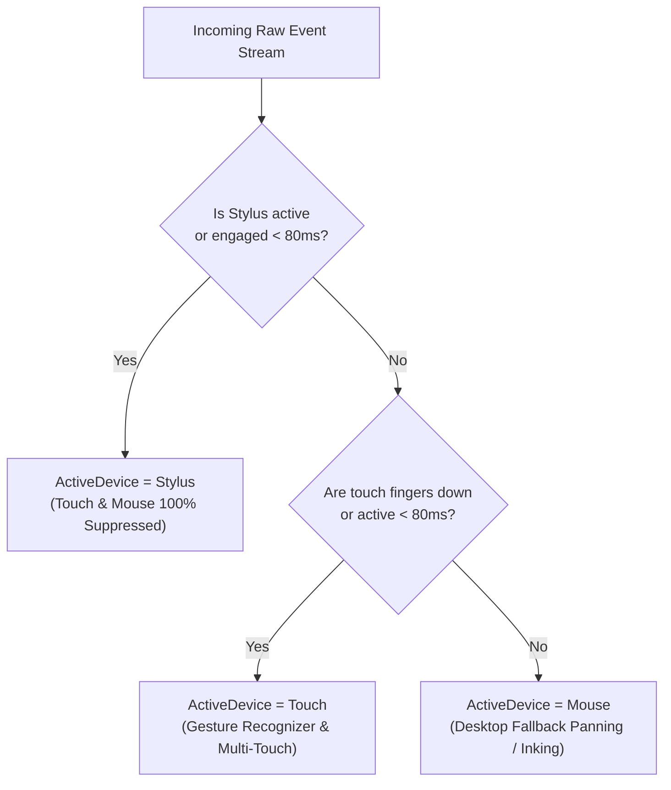
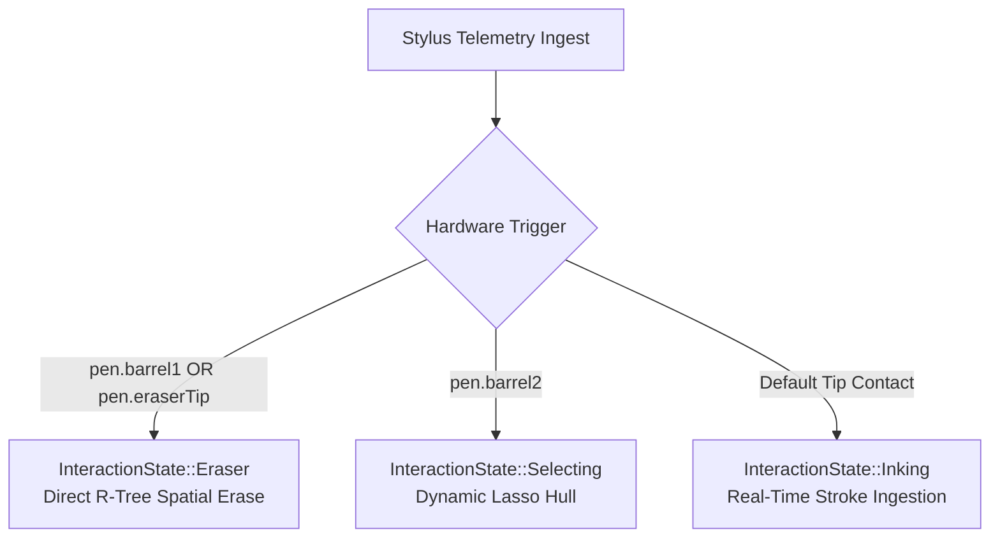
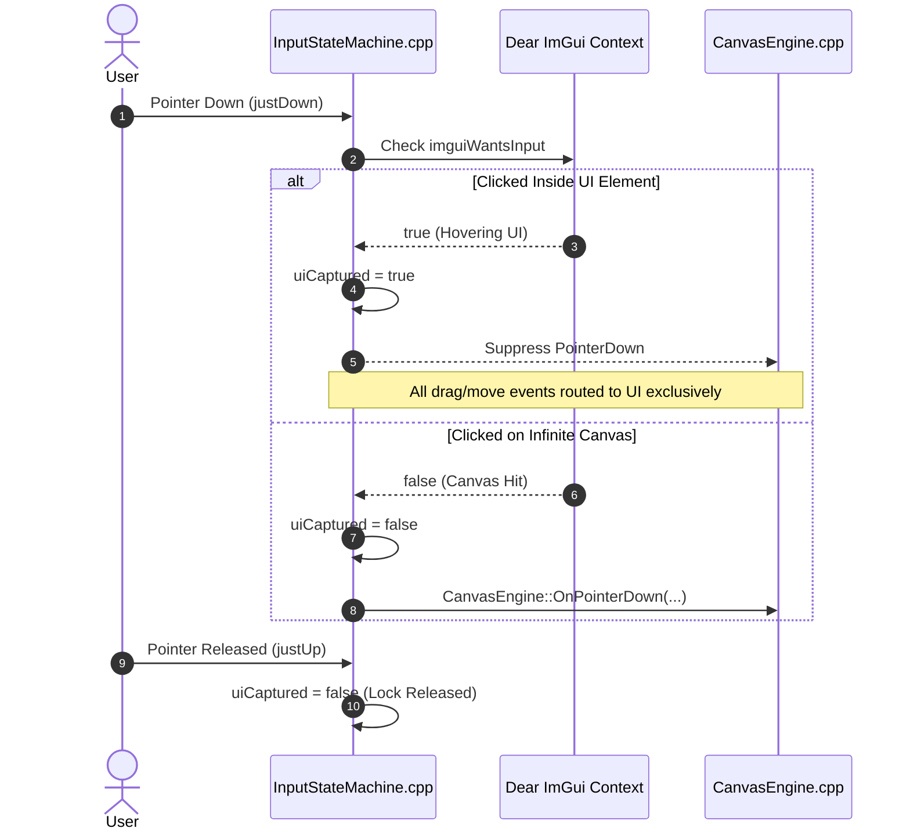
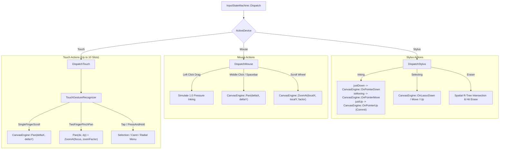

# Input State Machine & Hardware Arbitration

The `InputStateMachine` (`src/input/input_state_machine.hpp/.cpp`) sits between low-level SDL3 hardware telemetry and high-level canvas operations. It is responsible for hardware contention resolution, palm rejection, Dear ImGui UI capture arbitration, and gesture decoding.

---

## 🛡️ Device Priority Arbitration (Palm Rejection)

When drawing on a tablet or touch-enabled laptop, the user's palm frequently rests on the screen surface, generating concurrent touch and stylus packets. The engine resolves contention every frame via a strict priority hierarchy:

* **Active Lock Timeout ($80\text{ ms}$):** Once a device claims ownership, a short hysteresis cooldown prevents high-frequency touch noise from preempting an in-flight pen stroke between digitizer poll intervals.

---

## 🖊️ Stylus State & Tool Intent Mapping

When `ActiveDevice == Stylus`, the state machine maps physical sensor signals into semantic interaction states:

### 1. Proximity Tracking
* **`OutOfRange`:** Digitizer hover coil is idle.
* **`Hovering`:** Stylus tip is in proximity ($< 10\text{--}15\text{ mm}$) above the display surface ($P = 0.0$).
* **`Engaged`:** Stylus tip physically touches the screen ($P > 0.0$).

### 2. Hardware Button Intent Routing

---

## 🔒 UI Capture & Focus Arbitration (ImGui Interaction Locks)

To prevent accidental stroke artifacts when clicking on the Ribbon Bar, Navigation Sidebar, or Modal Dialogs, the engine enforces interaction capture locks:

---

## 📐 Coordinate Normalization

Raw digitizer pixels are mapped to canvas-local coordinates by offsetting interface panel margins before passing coordinates to the projection matrix:

$$\text{Local}_x = \text{Screen}_x - \text{CanvasOrigin}_x$$

$$\text{Local}_y = \text{Screen}_y - \text{CanvasOrigin}_y$$

*(Where $\text{CanvasOrigin}$ accounts for active dynamic sidebar width and top ribbon toolbar height).*

---

## ⚡ Device-Specific Dispatchers

---

## 📊 Summary of Event Routings

| Input Device | Interaction Trigger | Canvas Operation | Underlying Target Call |
|---|---|---|---|
| **Stylus** | Tip Contact ($P > 0$) | Stroke Ingestion | `CanvasEngine::OnPointerDown/Move/Up` |
| **Stylus** | Barrel 1 / Eraser Tip | Real-time Erasure | `DocumentSession::EraseAt(WorldPoint)` |
| **Stylus** | Barrel 2 | Freehand Lasso | `CanvasEngine::OnLassoDown/Move/Up` |
| **Mouse** | Left Drag | Fallback Inking | `CanvasEngine::OnPointerDown/Move/Up` |
| **Mouse** | Middle Drag / `Space` | Viewport Pan | `CanvasEngine::Pan(dx, dy)` |
| **Mouse** | Wheel Up / Down | Viewport Zoom | `CanvasEngine::ZoomAt(focus, 1.15 / 0.85)` |
| **Touch** | Two-Finger Pinch | Pan & Zoom | `CanvasEngine::Pan(...)` + `CanvasEngine::ZoomAt(...)` |
| **Touch** | 1-Finger Tap | Caret / Selection | `DocumentSession::SelectAt(WorldPoint)` |
