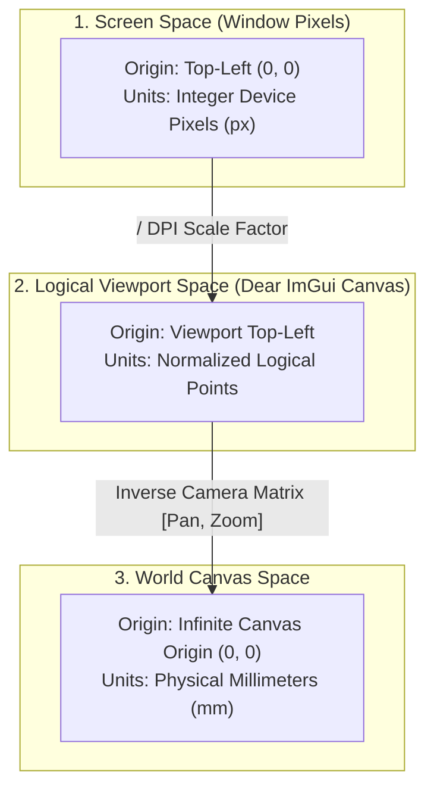

# Coordinate Transformations & Viewport Math

FolioNote operates across three distinct coordinate spaces to ensure resolution independence, sharp vector rasterization, and consistent pan/zoom navigation regardless of physical display density.

---

## 🗺️ The Three Coordinate Systems

---

## 📐 Affine Transformation Equations

Let:
* $(x_s, y_s)$ represent coordinates in logical screen/viewport space.
* $(x_w, y_w)$ represent continuous coordinates in world millimeters.
* $(\text{Pan}_x, \text{Pan}_y)$ represent current camera translation offsets (in logical points).
* $Z$ represent the camera zoom scale factor ($Z > 0$).

### Screen to World Transformation (Input Ingestion)

When digitizer input arrives from SDL3, screen pixels are mapped into continuous world millimeters:

$$x_w = \frac{x_s - \text{Pan}_x}{Z}$$

$$y_w = \frac{y_s - \text{Pan}_y}{Z}$$

### World to Screen Transformation (Rasterization / Blitting)

When projecting vector geometry and bounding boxes to the Blend2D buffer or OpenGL viewport:

$$x_s = (x_w \cdot Z) + \text{Pan}_x$$

$$y_s = (y_w \cdot Z) + \text{Pan}_y$$

---

## 🔍 Zoom-to-Cursor Anchor Math

When zooming via the mouse wheel, trackpad, or two-finger pinch gesture, the point directly beneath the cursor must remain fixed on screen during the zoom transition.

### Step-by-Step Derivation

1. **Calculate the cursor's world anchor coordinate before zooming:**

   $$x_{w,0} = \frac{x_s - \text{Pan}_{x,\text{old}}}{Z_{\text{old}}}$$

   $$y_{w,0} = \frac{y_s - \text{Pan}_{y,\text{old}}}{Z_{\text{old}}}$$

2. **Update the scale factor to $Z_{\text{new}}$:**

   $$Z_{\text{new}} = \text{clamp}(Z_{\text{old}} \cdot \Delta Z, \, Z_{\min}, \, Z_{\max})$$

3. **Solve for the new Pan offset** such that $(x_{w,0}, y_{w,0})$ evaluates to the exact same screen position $(x_s, y_s)$:

   $$x_s = (x_{w,0} \cdot Z_{\text{new}}) + \text{Pan}_{x,\text{new}}$$

   $$\text{Pan}_{x,\text{new}} = x_s - (x_{w,0} \cdot Z_{\text{new}})$$

   $$\text{Pan}_{y,\text{new}} = y_s - (y_{w,0} \cdot Z_{\text{new}})$$

---

## 📦 Viewport AABB Calculation

To cull off-screen elements with the R-Tree, the visible viewport rectangle is transformed into an Axis-Aligned Bounding Box ($\text{AABB}$) in world units ($mm$):

Let the logical viewport have width $W$ and height $H$:

$$\text{AABB}_{\text{viewport}} = \left[ \frac{-\text{Pan}_x}{Z}, \, \frac{-\text{Pan}_y}{Z}, \, \frac{W - \text{Pan}_x}{Z}, \, \frac{H - \text{Pan}_y}{Z} \right]$$

This bounding box is queried against the R-Tree spatial index each frame to retrieve only the visible stroke IDs.
