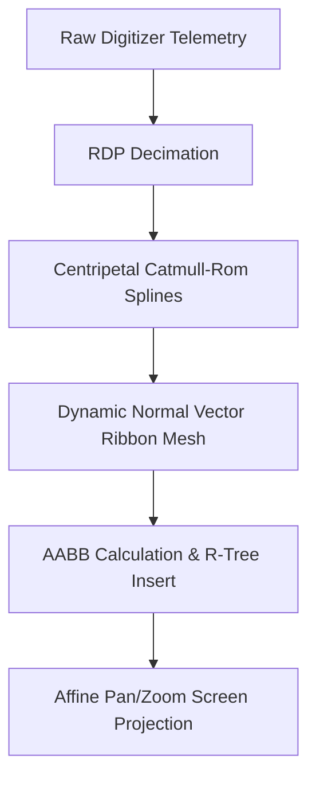

# Mathematics & Scientific Foundations

FolioNote relies on continuous differential geometry, signal processing, and spatial acceleration structures to deliver fluid inking, sharp rendering, and fast viewport culling.

---

## 🧮 Applied Mathematical Models

---

## 📚 Section Breakdown

| Module | Mathematical Focus | Primary Function |
|---|---|---|
| **[Stroke Polygon Math](stroke-polygon.md)** | Differential normal extrusion & bevel join fans | Constructs non-inverting triangle ribbons responsive to pressure and speed. |
| **[R-Tree Spatial Index](rtree.md)** | Axis-Aligned Bounding Box (AABB) partitioning | Viewport culling with $O(\log N)$ spatial search time across unbounded canvases. |
| **[Spline Interpolation](splines.md)** | Centripetal Catmull-Rom parameterization | Generates smooth, continuous curves without loops, cusps, or velocity overshoot. |
| **[Curve Decimation (RDP)](rdp-decimation.md)** | Ramer-Douglas-Peucker perpendicular distance | Eliminates redundant 480 Hz digitizer samples and filters high-frequency sensor noise. |
| **[Coordinate Transformations](coordinates.md)** | 2D Affine transformation matrices | Seamless mapping between window pixels, DPI scale factors, and physical canvas millimeters. |
