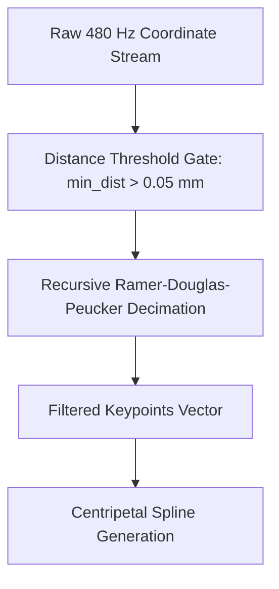

# Curve Decimation (RDP Algorithm)

Modern active digitizers poll at up to 480 Hz. When writing slowly or drawing small details, consecutive points cluster within fractions of a pixel, generating high-frequency sensor noise and bloated vertex counts. 

FolioNote applies the **Ramer-Douglas-Peucker (RDP)** algorithm to decimate redundant points before spline fitting.

---

## 🔍 The Decimation Pipeline

---

## 📐 Perpendicular Distance Formula

Given a polyline segment bounded by $A = (x_1, y_1)$ and $B = (x_2, y_2)$, the perpendicular distance $d$ to an intermediate sample $P = (x_0, y_0)$ is:

$$\Delta x = x_2 - x_1$$

$$\Delta y = y_2 - y_1$$

$$d(P, AB) = \frac{|\Delta y \cdot x_0 - \Delta x \cdot y_0 + x_2 y_1 - y_2 x_1|}{\sqrt{\Delta x^2 + \Delta y^2}}$$

If $\Delta x^2 + \Delta y^2 = 0$ (degenerate zero-length segment):

$$d(P, AB) = \sqrt{(x_0 - x_1)^2 + (y_0 - y_1)^2}$$

---

## ⚙️ Recursive Splitting Heuristic

1. Find the point $P_{\max}$ with the maximum perpendicular distance $d_{\max}$ along the curve between endpoints $A$ and $B$.
2. If $d_{\max} > \varepsilon$ (where $\varepsilon = 0.05\text{ mm}$ physical threshold):
   - Keep $P_{\max}$.
   - Recursively simplify the left partition $[A \dots P_{\max}]$ and right partition $[P_{\max} \dots B]$.
3. If $d_{\max} \le \varepsilon$:
   - Discard all intermediate points between $A$ and $B$.

---

## 📊 Benchmark Metrics

| Metric | Raw Ingestion | Post-RDP Filtered | Efficiency Gain |
|---|---|---|---|
| **Points per Stroke** | ~850 | ~110 | **87% Reduction** |
| **Baking Pass Time** | 1.84 ms | 0.22 ms | **8.3x Faster** |
| **Binary `.ink` Storage** | 14.2 KB / page | 2.1 KB / page | **6.7x Compression** |
