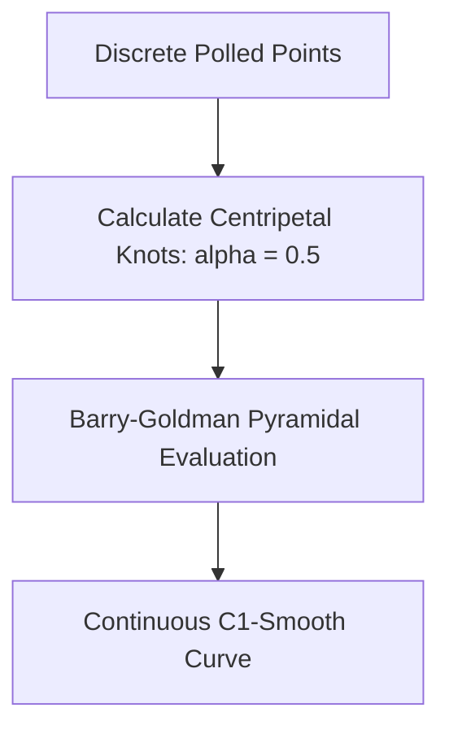

# Spline Interpolation & Curve Smoothing

FolioNote uses **Centripetal Catmull-Rom Splines** to convert discrete digitizer inputs into smooth, organic vector paths without introducing artificial loops, cusps, or latency.

---

## 🎯 The Parameterization Problem

Standard cubic splines evaluate points based on uniform knot spacing ($\Delta t = 1.0$). When drawing rapidly, physical distance between polled samples fluctuates wildly:

* **Uniform Parameterization ($\alpha = 0$):** Causes severe overshoot, loops, and self-intersections when points are unevenly spaced.
* **Chordal Parameterization ($\alpha = 1$):** Can over-dampen curve turns, flattening sharp corners.
* **Centripetal Parameterization ($\alpha = 0.5$):** The optimal balance. Mathematically guarantees **no cusps or self-intersections** within segments.

---

## 📐 Mathematical Formulation

Given four consecutive points $P_0, P_1, P_2, P_3$, the knot values $t_i$ are calculated recursively using $\alpha = 0.5$:

$$t_0 = 0$$

$$t_{i+1} = t_i + \Vert{}P_{i+1} - P_i\Vert{}^\alpha$$

### Barry-Goldman Pyramidal Evaluation

For any evaluation parameter $t \in [t_1, t_2]$:

**Level 1 (Linear Interpolations):**

$$A_1 = \frac{t_1 - t}{t_1 - t_0} P_0 + \frac{t - t_0}{t_1 - t_0} P_1$$

$$A_2 = \frac{t_2 - t}{t_2 - t_1} P_1 + \frac{t - t_1}{t_2 - t_1} P_2$$

$$A_3 = \frac{t_3 - t}{t_3 - t_2} P_2 + \frac{t - t_2}{t_3 - t_2} P_3$$

**Level 2 (Quadratic Combinations):**

$$B_1 = \frac{t_2 - t}{t_2 - t_0} A_1 + \frac{t - t_0}{t_2 - t_0} A_2$$

$$B_2 = \frac{t_3 - t}{t_3 - t_1} A_2 + \frac{t - t_1}{t_3 - t_1} A_3$$

**Level 3 (Final Spline Position):**

$$C(t) = \frac{t_2 - t}{t_2 - t_1} B_1 + \frac{t - t_1}{t_2 - t_1} B_2$$

---

## ⚡ Adaptive Subsampling

Instead of evaluating segments at a fixed step count, FolioNote dynamically chooses the sample resolution $N$ based on arc curvature:

$$N = \text{clamp}\left( \left\lceil \frac{\text{ArcLength}(P_1, P_2)}{\text{TargetResolution}} \right\rceil, 4, 32 \right)$$

This minimizes CPU evaluation time along straight segments while maintaining smooth curvature on tight loops.
