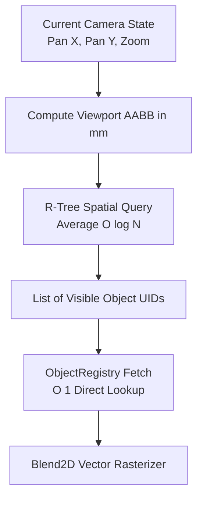

# R-Tree Spatial Indexing

To support unbounded, infinite canvases containing tens of thousands of vector strokes and objects, FolioNote uses a 2D **R-Tree** spatial bounding box index for fast viewport culling.

---

## 📦 Bounding Box Representation

All spatial primitives on the canvas are defined by an Axis-Aligned Bounding Box ($\text{AABB}$) in world millimeters ($mm$):

$$\text{AABB} = [x_{\min}, y_{\min}, x_{\max}, y_{\max}]$$

### Fast Intersection Test

Two bounding boxes $A$ and $B$ intersect if and only if their 1D projection intervals overlap along both axes:

$$\text{Intersects}(A, B) \iff (A.x_{\min} \le B.x_{\max}) \land (A.x_{\max} \ge B.x_{\min}) \land (A.y_{\min} \le B.y_{\max}) \land (A.y_{\max} \ge B.y_{\min})$$

---

## 🔍 Viewport Culling Pipeline

---

## ⚡ Performance Characteristics

* **Decoupled Keys:** The R-Tree stores only lightweight key pairs (`AABB` + `uint32_t UID`).
* **Cache Efficiency:** Viewport traversal iterates tightly packed bounding boxes in CPU cache lines without loading heavy stroke coordinate arrays into memory.
* **Query Complexity:** Spatial search scales at $O(\log N)$ on average, keeping frame render loops at 120+ FPS regardless of total canvas scale.

---

## 🎮 Interactive R-Tree Spatial Explorer

Interact directly with the index structure below. Double-click to create note bounding boxes, drag with the left mouse button to test range queries, or drag with the right mouse button to move items:

  <iframe 
    src="/FolioNote/assets/rtree-demo.html" 
    style="position: absolute; top: 0; left: 0; width: 100%; height: 100%; border: 0;"
    loading="lazy"
    title="Interactive R-Tree Indexing Demo">
  </iframe>

---
