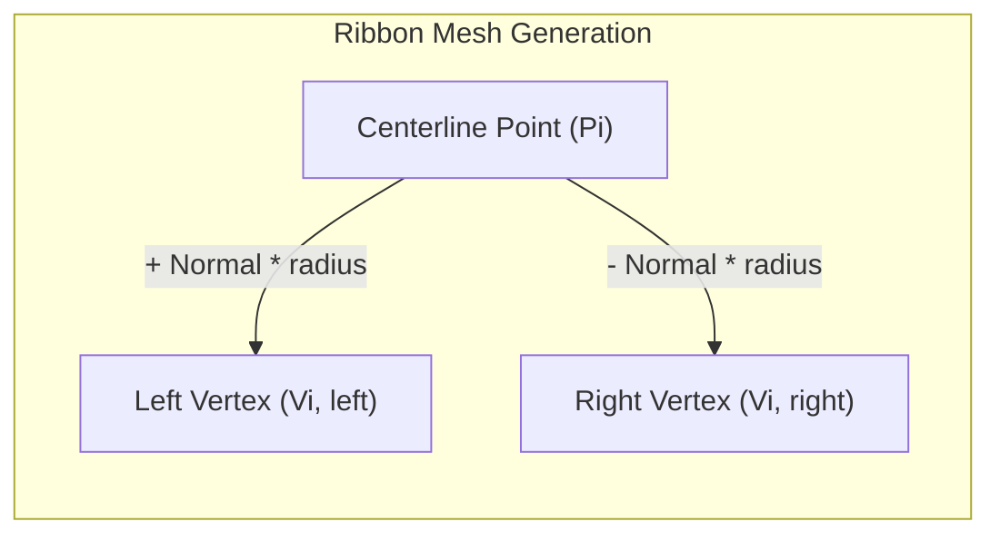
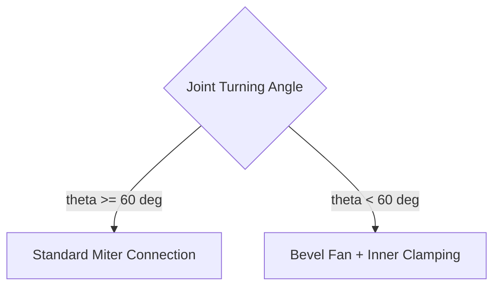

# Dynamic Stroke Polygon Construction

To render variable-width strokes responsive to stylus pressure and velocity, the engine constructs dynamic 2D polygon triangle strips along the smoothed spline path.

---

## 📐 Normal Vector Extrusion

For each point $P_i$ along the curve with dynamic radius $r_i$:

1. Compute unit tangent vector $\vec{T}_i$:
   $$\vec{T}_i = \frac{P_{i+1} - P_{i-1}}{\|P_{i+1} - P_{i-1}\|}$$

2. Compute perpendicular unit normal $\vec{N}_i$:
   $$\vec{N}_i = (-\vec{T}_{i,y}, \vec{T}_{i,x})$$

3. Extrude left and right vertex boundaries:
   $$V_{i,\text{left}} = P_i + \vec{N}_i \cdot r_i$$
   $$V_{i,\text{right}} = P_i - \vec{N}_i \cdot r_i$$

---

## 🛡️ Sharp Turn Handling & Miter Clamping

When consecutive segments form sharp angles ($\theta < 60^\circ$), standard miter joints can produce elongated spikes or self-intersecting artifacts.

FolioNote resolves sharp angles using **Bevel and Fan Joins**:

* **Inner Vertices:** Clamped to the angle bisector intersection to prevent overlapping or inverted geometry.
* **Outer Vertices:** Expanded into a rounded fan to maintain consistent visual thickness throughout corners.

---

## 🎮 Interactive Stroke Geometry Lab

Try drawing on the interactive canvas below. Adjust the **Spatial Filter** and **Stroke Width** in real time to see how the engine generates normal vectors, clamps miter joins, and constructs the polygon mesh:

  <iframe 
    src="../interactive/stroke-demo.html" 
    style="position: absolute; top: 0; left: 0; width: 100%; height: 100%; border: 0;"
    loading="lazy"
    title="Interactive Stroke Geometry Demo">
  </iframe>

