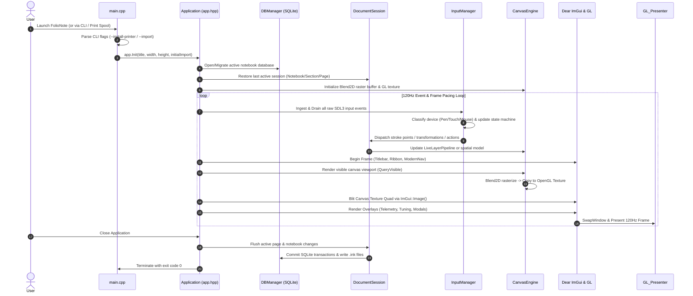
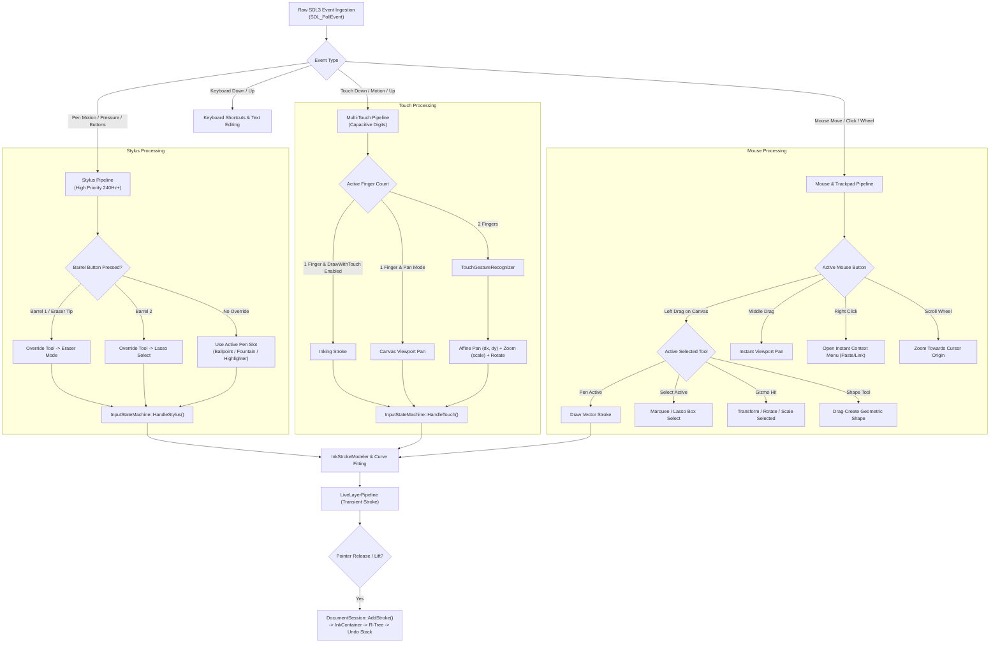
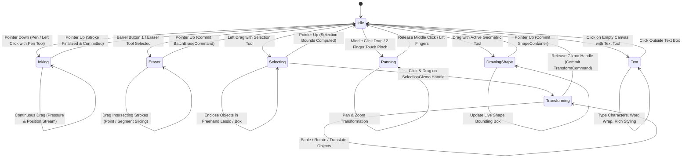
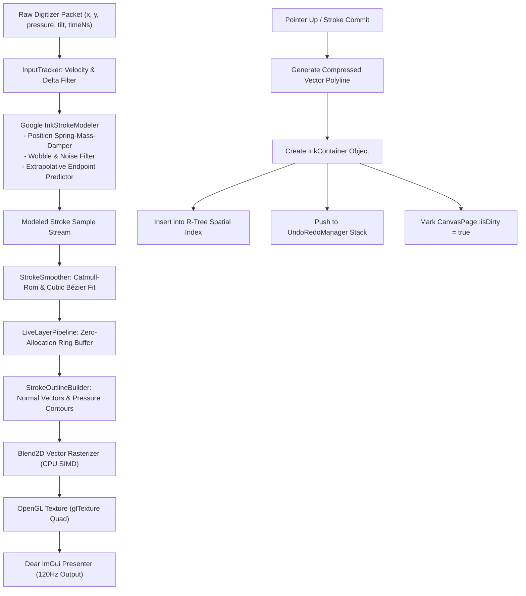
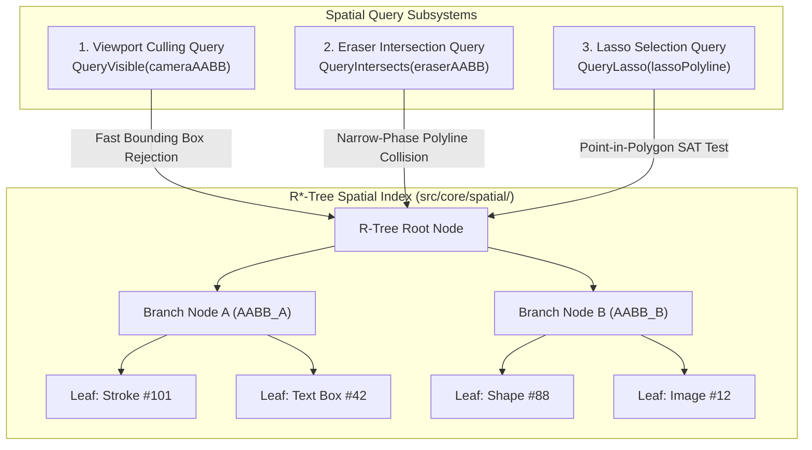
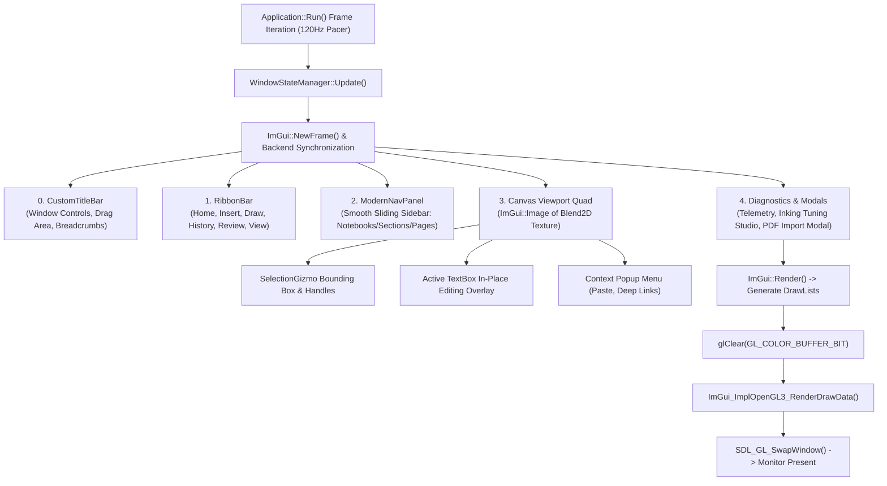
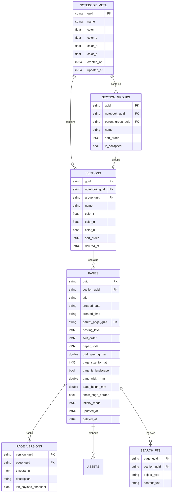
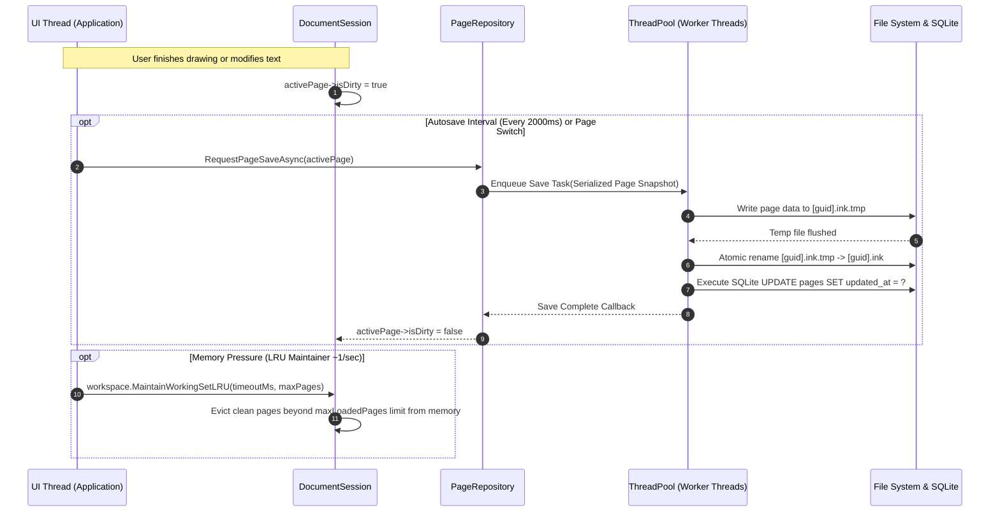
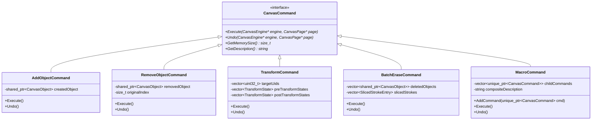

# FolioNote Architecture & System Workflow Reference

> **Document Location:** `src/WORKFLOW.md`  
> **Version:** 2.0 (High-Performance Infinite Canvas Architecture)  
> **Target Framework:** C++20, SDL3, Dear ImGui, Blend2D, SQLite3, Ink-Stroke-Modeler, LunaSVG  

---

## Table of Contents

1. [System Architecture Overview](#1-system-architecture-overview)
2. [Complete Source Code Tree Outline](#2-complete-source-code-tree-outline)
3. [End-to-End Runtime Lifecycle](#3-end-to-end-runtime-lifecycle)
4. [Multimodal Input Pipeline (Hardware to Canvas)](#4-multimodal-input-pipeline-hardware-to-canvas)
5. [Input State Machine & Interaction States](#5-input-state-machine--interaction-states)
6. [Inking, Smoothing & Real-Time Render Pipeline](#6-inking-smoothing--real-time-render-pipeline)
7. [Spatial Indexing & Hit-Testing Architecture](#7-spatial-indexing--hit-testing-architecture)
8. [UI Orchestration & Frame Presentation](#8-ui-orchestration--frame-presentation)
9. [Storage, Database & Persistence System](#9-storage-database--persistence-system)
10. [Command History & Transactional Undo/Redo](#10-command-history--transactional-undoredo)
11. [Mathematical Foundations & Algorithms](#11-mathematical-foundations--algorithms)

---

## 1. System Architecture Overview

FolioNote is engineered as an ultra-low-latency, multi-platform, infinite-canvas digital notebook. It separates high-frequency raw digitizer inputs, vector smoothing, asynchronous transactional persistence, and 120Hz/60Hz adaptive frame presentation into decoupled subsystems.

```mermaid
graph TD
    subgraph Hardware_And_OS ["Hardware & OS Layer"]
        HW_Pen["Stylus / Digitizer (240Hz+)"]
        HW_Touch["Multi-Touch Screen"]
        HW_Mouse["Mouse & Keyboard"]
        HW_Print["Virtual Printer / Shell Spool"]
    end

    subgraph Input_Subsystem ["Input Subsystem (src/input/)"]
        SDL_Loop["SDL3 Event Polling Loop (120Hz Pacer)"]
        InpMgr["InputManager"]
        InpTracker["InputTracker (History Buffer)"]
        TouchRec["TouchGestureRecognizer (Pinch/Pan/Rotate)"]
        ISM["InputStateMachine (Device Arbitration)"]
        SpecAct["SpecialActionManager (Barrel Overrides)"]
    end

    subgraph Core_Engine ["Core Engine & Spatial (src/core/)"]
        StrokeModeler["InkStrokeModeler & StrokeSmoother"]
        LivePipeline["LiveLayerPipeline (Blend2D Active Path)"]
        CanvasEng["CanvasEngine (Viewport, Blit & Overlays)"]
        RTreeIndex["R-Tree Spatial Index & AABB Culling"]
        SelectionGizmo["SelectionGizmo (Transform, Rotate, Scale)"]
        UndoRedo["UndoRedoManager & CanvasCommand History"]
    end

    subgraph Document_Hierarchy ["Document Model (src/core/document/)"]
        DocSession["DocumentSession (Controller / Facade)"]
        Workspace["Workspace (Notebook Manager)"]
        Notebook["Notebook (.fn Container)"]
        SectionGroup["SectionGroup (Folders)"]
        Section["Section"]
        CanvasPage["CanvasPage (In-Memory Working Set)"]
    end

    subgraph Storage_Persistence ["Persistence Layer (src/core/storage/ & utils/)"]
        DbMgr["DBManager (SQLite3 WAL Mode)"]
        BinSerializer["BinarySerializer (.ink Payload)"]
        PageRepo["PageRepository (Async Flush)"]
        ThreadPool["ThreadPool (Background I/O)"]
        SearchIndex["NotebookSearchIndex (SQLite FTS5)"]
        BackupMgr["BackupManager & PageVersionManager"]
    end

    subgraph UI_Presentation ["Presentation Layer (src/ui/ & src/app/)"]
        ImGuiContext["Dear ImGui Framework"]
        TitleBar["CustomTitleBar (Borderless Frame)"]
        Ribbon["RibbonBar (Full / Mini / Collapsed / Hidden)"]
        ModernNav["ModernNavPanel (Sidebar Navigation)"]
        CanvasPanel["Canvas Viewport Texture Quad"]
        Overlays["Telemetry / Tuning / Import Modals"]
        GL_Presenter["OpenGL 3.3 / GLES 3.0 Presenter"]
    end

    HW_Pen --> SDL_Loop
    HW_Touch --> SDL_Loop
    HW_Mouse --> SDL_Loop
    HW_Print --> SDL_Loop

    SDL_Loop --> InpMgr
    InpMgr --> InpTracker
    InpMgr --> TouchRec
    InpMgr --> ISM
    ISM --> SpecAct

    ISM --> StrokeModeler
    ISM --> SelectionGizmo
    StrokeModeler --> LivePipeline
    LivePipeline --> CanvasEng

    ISM --> DocSession
    DocSession --> UndoRedo
    DocSession --> CanvasPage
    CanvasPage --> RTreeIndex

    CanvasEng --> CanvasPanel
    TitleBar --> ImGuiContext
    Ribbon --> ImGuiContext
    ModernNav --> ImGuiContext
    CanvasPanel --> ImGuiContext
    Overlays --> ImGuiContext
    ImGuiContext --> GL_Presenter

    CanvasPage -.->|Async Save Request| PageRepo
    PageRepo --> BinSerializer
    PageRepo --> DbMgr
    DbMgr --> SearchIndex
    ThreadPool --> PageRepo
    Workspace --> BackupMgr
```



---

## 2. Complete Source Code Tree Outline

```
src/
├── main.cpp                              # App entry point, CLI arguments, headless virtual printer dispatch
├── folionote.rc                          # Windows PE resource script (Icon, version metadata)
├── logo.ico                              # High-resolution multi-size application icon
├── WORKFLOW.md                           # System workflow and architectural reference (this file)
│
├── app/                                  # High-level application lifecycle, windowing, and settings
│   ├── app.hpp                           # Master Application class: init, 120Hz frame loop, layout composition, shutdown
│   ├── app_view_mode.hpp                 # View routing enum (CanvasWorkspace vs NotebookHub)
│   ├── settings_manager.hpp              # Persistent configuration JSON manager (pen palettes, view settings, LRU)
│   ├── theme_manager.hpp                 # Dynamic visual theming (Light/Dark mode, accent colors, tokens)
│   └── window_state_manager.hpp          # Window resize stabilization, minimization freeze, frame throttling
│
├── core/                                 # Core document model, math, rendering engine, and spatial indexing
│   ├── backup/                           # Version history, automatic snapshotting, and crash recovery
│   │   ├── backup_manager.hpp / .cpp     # Whole-notebook zip/folder archive rotation and periodic backup
│   │   └── page_version_manager.hpp/.cpp # Per-page snapshot commits and historical rollback diffs
│   │
│   ├── document/                         # Hierarchical document structure and session management
│   │   ├── canvas_page.hpp               # In-memory page object: object registry, R-Tree, viewport continuity, background style
│   │   ├── document_observer.hpp         # Observer interface for reactive UI updates on document mutations
│   │   ├── document_session.hpp          # Top-level runtime session facade orchestrating workspace, commands, and tools
│   │   ├── notebook.hpp / .cpp           # Notebook entity: sections, section groups, metadata, dirty state tracking
│   │   ├── section.hpp                   # Section container holding ordered canvas pages
│   │   ├── section_group.hpp             # Hierarchical folder grouping sections together
│   │   ├── workspace.hpp                 # Multi-notebook repository, active notebook switching, LRU memory manager
│   │   ├── library/                      # Notebook discovery, cloning, template creation, and trash bin
│   │   │   ├── library.hpp / .cpp        # Master library registry scanning user notebooks directory
│   │   │   ├── library_discovery.cpp     # File system traversal indexing .fn packages
│   │   │   ├── library_trash.cpp         # Soft-delete recycle bin and restore orchestration
│   │   │   └── notebook_cloner.cpp       # Deep cloning and template duplication logic
│   │   └── session/                      # Split implementation domains of DocumentSession
│   │       ├── session_canvas_ops.cpp    # Stroke additions, object transforms, grouping, clipboard insertion
│   │       ├── session_history.cpp       # Undo/Redo dispatch, transaction boundaries, batch eraser commits
│   │       ├── session_lifecycle.cpp     # Session initialization, notebook loading, dirty state verification
│   │       ├── session_metadata.cpp      # Page styling, paper templates, background grid spacing, metadata DTOs
│   │       └── session_navigation.cpp   # Deep link navigation, page switching, in-memory camera caching
│   │
│   ├── engine/                           # High-speed graphics rendering engine and stroke processing
│   │   ├── canvas_engine.hpp             # Viewport blitting, grid rendering, Blend2D software rasterizer to GL texture
│   │   ├── canvas_transform.hpp          # Affine transformation pipeline: Screen <-> Viewport <-> World mm coordinates
│   │   ├── gizmo_types.hpp               # Handle hit-test enumerations, pivot points, interaction modes
│   │   ├── live_layer_pipeline.hpp       # Real-time active inking buffer with zero-allocation ring buffer
│   │   ├── selection_gizmo.hpp           # Interactive bounding box: translation, non-uniform scale, rotation, flipping
│   │   ├── stroke_collision.hpp          # High-speed geometric collision (Point-to-Stroke, Segment Slicing, Lasso Box)
│   │   ├── stroke_outline_builder.hpp    # Polygonal stroke geometry generation from pressure-modeled centerline paths
│   │   └── stroke_smoother.hpp           # Google InkStrokeModeler integration, spring-damper physics, prediction
│   │
│   ├── export/                           # Multi-format document serialization and printing exporters
│   │   ├── export_manager.hpp / .cpp     # Central export dispatcher coordinating format conversions
│   │   ├── html_svg_exporter.hpp / .cpp  # Self-contained responsive HTML5/SVG vector export
│   │   ├── markdown_exporter.hpp / .cpp  # Markdown structured text export with embedded vector graphics
│   │   ├── package_exporter.hpp / .cpp   # Zipped `.fn` notebook archive packager
│   │   ├── pdf_vector_exporter.hpp / .cpp# High-resolution vector PDF exporter via Cairo/Blend2D
│   │   └── sheet_tiler.hpp / .cpp        # Infinite canvas multi-page A4/Letter grid slicing and layout tiler
│   │
│   ├── history/                          # GoF Command Pattern undo/redo subsystem
│   │   ├── canvas_command.hpp / .cpp     # Command interfaces: Add, Remove, Transform, BatchErase, MacroCommand
│   │   └── command_history.hpp           # Bounded dual-stack command manager with memory limits
│   │
│   ├── import/                           # External document ingestion and parsing
│   │   ├── import_manager.hpp / .cpp     # External asset dispatcher (Images, PDF documents, Text)
│   │   └── package_importer.hpp / .cpp   # `.fn` zip container extractor and SQLite database validator
│   │
│   ├── objects/                          # Canvas element domain hierarchy (Polymorphic CanvasObject)
│   │   ├── canvas_object.hpp             # Abstract base class: UID, AABB bounds, serialization, hit-test, render
│   │   ├── attachment_container.hpp      # File attachment tiles with embedded icon, name, and size
│   │   ├── image_container.hpp           # Embedded raster bitmap image container (PNG, JPEG, WebP)
│   │   ├── ink_container.hpp / .cpp      # Continuous vector ink stroke containing pressure points and smoothed paths
│   │   ├── pdf_container.hpp             # Embedded PDF page object with vector background caching
│   │   ├── shape_container.hpp / .cpp    # Unified vector shapes container (Rect, Ellipse, Polygon, Waves)
│   │   ├── table_container.hpp           # Interactive vector table object with grid cells and text runs
│   │   ├── text_box.hpp                  # Standalone text box container with rich formatting
│   │   ├── connectors/                   # Dynamic vector connectors & smart arrows
│   │   │   ├── connector_types.hpp       # Arrow head styles, curvature modes, anchor types
│   │   │   └── smart_arrow_container.hpp # Smart connector with automatic bounding box magnetic docking
│   │   ├── links/                        # Deep-linking canvas objects
│   │   │   └── link_object.hpp           # Clickable hyperlinks referencing web URLs or internal pages
│   │   ├── media/                        # Embedded audio and video playback containers
│   │   │   ├── audio_container.hpp       # Voice note audio player container with waveform visualizer
│   │   │   └── video_container.hpp       # Embedded video frame container
│   │   ├── primitives/                   # Geometric primitives, dashers, and wave shapes
│   │   │   ├── path_dasher.hpp           # Vector stroke dash and dot pattern generator
│   │   │   ├── shape_types.hpp           # Geometric enumeration (Line, Arrow, DoubleArrow, Rect, Star, Callout)
│   │   │   └── wave_shapes.hpp / .cpp    # Sine, triangle, and square wave algorithmic shape generators
│   │   └── text/                         # Rich text processing and editor state
│   │       ├── text_box.hpp / .cpp       # Multi-run rich text object supporting inline formatting
│   │       ├── text_editor_state.hpp/.cpp# Interactive text cursor, selection span, font styling, word wrap
│   │       └── text_run.hpp              # Atomic run of characters sharing identical font, weight, and color
│   │
│   ├── render/                           # Rendering utilities and specialized layers
│   │   ├── pdf_renderer.hpp              # High-speed PDF rasterization bridge using PDFium/lunasvg
│   │   └── pdf_text_layer.hpp            # Selectable invisible vector text overlay on top of rendered PDF
│   │
│   ├── search/                           # Full-text indexing and fuzzy notebook searching
│   │   └── notebook_search_index.hpp/.cpp# SQLite FTS5 indexer for handwriting, text boxes, and PDF text
│   │
│   ├── spatial/                          # High-performance spatial query structures
│   │   ├── aabb.hpp                      # 2D Axis-Aligned Bounding Box with intersection/union math
│   │   ├── r_tree.hpp / .cpp             # Dynamic R*-Tree spatial partitioning index for sub-millisecond culling
│   │   └── undo_redo_manager.hpp         # High-level undo manager wrapper with observer synchronization
│   │
│   ├── storage/                          # Persistence engine, SQLite transactions, and binary serialization
│   │   ├── binary_serializer.hpp / .cpp  # Ultra-fast binary stroke serializer/deserializer (.ink format)
│   │   ├── db_manager.hpp / .cpp         # Multi-threaded SQLite3 manager (WAL mode, schema migrations)
│   │   ├── page_repository.hpp           # Page data repository managing dirty writes and background threads
│   │   └── pdf_storage.hpp               # PDF blob cache and deduplication manager
│   │
│   └── text/                             # Font caching and text measurement
│       └── font_manager.hpp / .cpp       # Dynamic FreeType / System font loader and glyph metric caching
│
├── input/                                # Multimodal hardware input arbitration and state machine
│   ├── input_manager.hpp / .cpp          # Top-level input gateway routing raw SDL3 events to active subsystems
│   ├── input_state_machine.hpp           # Compatibility forwarder for the input state machine
│   ├── input_tracker.hpp                 # Temporal input sample history buffer for velocity/acceleration math
│   ├── pen_palette.hpp                   # Pen slot manager (Ballpoint, Fountain, Highlighter, Laser, Pencil)
│   ├── preset_manager.hpp                # Persistent pen preset library and custom color palette slots
│   ├── touch_gesture_recognizer.hpp      # Two-finger pinch-to-zoom, pan, rotation, and palm rejection classifier
│   └── stateMachine/                     # Fine-grained device state machines and button arbitration
│       ├── input_configuration.hpp       # Calibration thresholds (drag deadzone, double-tap speed, palm filter)
│       ├── input_state_machine.hpp / .cpp# Master device state machine arbitrating Stylus, Touch, and Mouse
│       ├── input_state_machine_mouse.cpp # Mouse-specific state handlers (lasso, panning, gizmo drags, click-to-type)
│       ├── input_state_machine_stylus.cpp# Stylus-specific handlers (pressure inking, barrel eraser/lasso overrides)
│       ├── input_state_machine_touch.cpp # Touch-specific handlers (finger drawing vs 2-finger camera glide)
│       └── special_action_manager.hpp/.cpp# Stylus hardware button triggers, eraser tip detection, quick actions
│
├── ui/                                   # User interface, panels, ribbon, navigation, and overlays
│   ├── icon_manager.hpp                  # Vector SVG icon renderer and GL texture atlas cache
│   ├── imgui_theme.hpp                   # FolioTheme token definitions, fonts, color palettes, custom push helpers
│   ├── components/                       # Modular reusable Dear ImGui UI components
│   │   ├── custom_titlebar.hpp           # Windows/Linux custom borderless titlebar with window controls
│   │   ├── debug_overlay.hpp             # Real-time telemetry: FPS, digitizer rate, frame latency, memory LRU
│   │   ├── dialogs.hpp                   # Modal confirmation dialogs, rename prompts, delete warnings
│   │   ├── modern_nav_panel.hpp          # Smooth animated sidebar: Notebooks, Section Groups, Sections, Pages
│   │   ├── notebook_nav.hpp              # Tabbed section navigation strip with drag-to-reorder tabs
│   │   ├── pdf_import_modal.hpp          # Interactive modal for placing newly printed/imported PDF documents
│   │   ├── ribbon_bar.hpp                # Microsoft 365-style Ribbon toolbar (Tabs, Pen Gallery, Action Groups)
│   │   ├── text_container_view.hpp       # In-place rich text editing container overlay with formatting floating bar
│   │   ├── toolbar_builder.hpp / .cpp    # Declarative fluent builder for high-density tool strips
│   │   ├── toolbar_demo_overlay.hpp      # Live preview testing sandbox for ribbon styles
│   │   └── tuning_overlay.hpp            # Interactive live inking tuning studio (spring physics, smoothing weights)
│   └── views/                            # Full-page dedicated application views
│       ├── notebook_hub.hpp              # Notebook Hub: Grid/List view of all notebooks, templates, trash, settings
│       └── pdf_viewer_page.hpp           # High-efficiency dedicated continuous PDF reader with annotation layer
│
└── utils/                                # Core utilities, logging, thread pooling, and platform helpers
    ├── error_codes.hpp / .md             # Centralized structured application error codes and troubleshooting guide
    ├── file_loader.hpp                   # Zero-copy memory-mapped file reader helper
    ├── file_logger.hpp                   # Structured multi-sink file logger with automatic size-based rotation
    ├── file_manager.hpp / .cpp           # High-level file system operations: atomic copy, directory tree management
    ├── file_saver.hpp                    # Atomic safe file writer (write to temp file -> rename on success)
    ├── guid_generator.hpp                # Standard OS UUID v4 generator
    ├── logger.hpp                        # High-throughput logging macros (`LOG_INFO`, `LOG_WARN`, `LOG_ERROR`)
    ├── package_marker.hpp                # `.fn` directory marker and package integrity validator
    ├── printer_installer.hpp             # Windows "Print to FolioNote" virtual printer installer/uninstaller
    ├── thread_pool.hpp                   # Generic task-stealing worker thread pool for async database writes
    ├── uid_generator.hpp                 # Fast monotonic 32-bit unique ID generator for in-memory CanvasObjects
    └── usage_tracker.hpp                 # Local privacy-preserving usage statistics tracker (drawing time, clicks)
```

---

## 3. End-to-End Runtime Lifecycle

The runtime lifecycle of FolioNote consists of five sequential phases:



---

## 4. Multimodal Input Pipeline (Hardware to Canvas)

FolioNote handles three distinct physical input modalities simultaneously, enforcing deterministic device arbitration:



---

## 5. Input State Machine & Interaction States

The application state machine (`InputStateMachine`) maintains isolated state for each physical input device.

### 5.1 State Transition Matrix



### 5.2 Interaction State Summary Table

| Interaction State | Primary Trigger Modality | Mathematical / Engine Action | Produced Command / History Action |
| :--- | :--- | :--- | :--- |
| **`Idle`** | No active pointer drag | R-Tree hover query, cursor icon update | None |
| **`Inking`** | Stylus tip down / Left drag (Draw mode) | Spring-damper smoothing, live path tessellation | `AddObjectCommand(InkContainer)` |
| **`Eraser`** | Stylus barrel 1 / Eraser tip / Eraser tool | Ray-segment intersection, Catmull-Rom splitting | `BatchEraseCommand` (Atomic deletion/slice) |
| **`Selecting`** | Left drag (Lasso / Marquee tool) | Point-in-polygon / AABB containment query | Selects objects into `SelectionGizmo` |
| **`Transforming`** | Dragging gizmo handles (Scale, Rotate, Move) | Affine transformation matrix applied to selected elements | `TransformCommand` (Pre/Post transform states) |
| **`Panning`** | Middle drag / 2-finger touch gesture | Viewport offset $(\Delta x, \Delta y)$ and camera zoom factor | Viewport continuity update (No undo history) |
| **`DrawingShape`** | Left drag with geometric shape tool | Bounding box computation, dynamic corner radius | `AddObjectCommand(ShapeContainer)` |
| **`Text`** | Left click with text tool / Double-click text | UTF-8 text layout, glyph metric measurement, caret | `AddObjectCommand(TextBoxObject)` or Modify |

---

## 6. Inking, Smoothing & Real-Time Render Pipeline

High-fidelity inking requires sub-8ms latency while generating smooth vector contours from noisy digitizer samples.



### Inking Latency Optimizations:
1. **Uncapped Input Drain:** All pending digitizer packets are processed at full hardware frequency (240Hz–480Hz) on each loop iteration before rendering begins.
2. **Dual-Path Inking Architecture:** Active strokes are rendered exclusively through `LiveLayerPipeline` into a lightweight scratch layer, completely bypassing expensive full-canvas scene rebakes until pointer release.
3. **SIMD Software Rasterization:** Blend2D utilizes runtime-detected AVX2/NEON vector instructions to rasterize Bezier curves directly into an RGBA32 texture buffer.

---

## 7. Spatial Indexing & Hit-Testing Architecture

FolioNote employs a dynamic 2D **R\*-Tree** spatial partitioning structure to ensure $O(\log N)$ query times even with tens of thousands of vector strokes, images, and text boxes on an infinite canvas.



### Hit-Test Acceleration Rules:
- **Broad-Phase:** Rejects elements whose `AABB` does not overlap the query bounding box.
- **Narrow-Phase (Strokes):** Computes exact point-to-line-segment Euclidean distance:
  $$d = \frac{|(y_2 - y_1)x_0 - (x_2 - x_1)y_0 + x_2 y_1 - y_2 x_1|}{\sqrt{(y_2 - y_1)^2 + (x_2 - x_1)^2}}$$
- **Narrow-Phase (Shapes & Text):** Performs Separating Axis Theorem (SAT) oriented bounding box tests.

---

## 8. UI Orchestration & Frame Presentation

The interface is structured using Dear ImGui with custom styling tokens (`FolioTheme`).



---

## 9. Storage, Database & Persistence System

FolioNote uses a hybrid container format (`.fn` packages) combining SQLite3 for relational metadata with optimized binary vector streams for page graphics payloads.

### 9.1 Package Container Architecture

```
Notebook Package Directory: "My Notebook.fn/"
├── notebook.db          # Embedded SQLite database (schema, sections, page catalog, FTS5 index)
├── notebook.db-wal      # SQLite Write-Ahead Log (high-concurrency writes)
├── notebook.db-shm      # SQLite Shared-Memory Index
└── pages/               # Binary graphics payloads
    ├── 550e8400-e29b-41d4-a716-446655440000.ink       # Vector stroke binary payload
    ├── 550e8400-e29b-41d4-a716-446655440000.ink.wal   # Instant action journal
    └── 6ba7b810-9dad-11d1-80b4-00c04fd430c8.ink
```

### 9.2 Relational Database Schema (`notebook.db`)



### 9.3 Binary `.ink` Serialization Format

The `.ink` binary file is engineered for high read/write performance:

```
┌────────────────────────────────────────────────────────────────────────┐
│                      FolioNote .INK Binary Format                      │
├─────────────────┬──────────────┬───────────────────────────────────────┤
│ Field           │ Type         │ Description                           │
├─────────────────┼──────────────┼───────────────────────────────────────┤
│ Magic Header    │ uint32 (4B)  │ Magic bytes: 'F' 'N' 'I' 'K' (0x4B494E46)│
│ Format Version  │ uint32 (4B)  │ Serialization version (e.g., 0x00000002)│
│ Object Count    │ uint32 (4B)  │ Total serialized CanvasObjects on page │
├─────────────────┴──────────────┴───────────────────────────────────────┤
│ Repeated Stream of Serialized Canvas Objects                           │
├─────────────────┬──────────────┬───────────────────────────────────────┤
│ Object Type ID  │ uint8 (1B)   │ 1=Ink, 2=Image, 3=Text, 4=Shape, etc. │
│ Unique ID (UID) │ uint32 (4B)  │ In-memory instance identifier         │
│ Bounding AABB   │ 4x double    │ minX, minY, maxX, maxY (in mm)        │
│ Transform Flags │ uint32 (4B)  │ Locked, hidden, group parent UID      │
│ Payload Length  │ uint32 (4B)  │ Byte count of following object stream │
│ Payload Data    │ byte[...]    │ Specific vector or raw point buffers  │
└─────────────────┴──────────────┴───────────────────────────────────────┘
```

### 9.4 Asynchronous Save & Working Set LRU Pipeline



---

## 10. Command History & Transactional Undo/Redo

FolioNote implements the **Gang of Four (GoF) Command Pattern** combined with **Composite Macros** to provide fine-grained undo and redo capabilities across all canvas operations.



### Transaction Boundaries:
- **Continuous Inking:** Single `AddObjectCommand` created upon stylus release.
- **Continuous Eraser Drag:** Aggregated into an atomic `BatchEraseCommand` on pointer release, ensuring single-step undo for an entire erase stroke.
- **Gizmo Manipulation:** Pre-transform snapshot captured on handle mouse-down; post-transform snapshot captured on mouse-up; committed as a single `TransformCommand`.
- **Complex Operations (Align/Distribute/Import):** Grouped into a `MacroCommand`.

---

## 11. Mathematical Foundations & Algorithms

### 11.1 Affine Coordinate Transformation Pipeline

FolioNote uses three coordinate spaces:
1. **Screen Coordinates ($P_{\text{screen}}$):** Pixels relative to the operating system application window $(x_{\text{pixel}}, y_{\text{pixel}})$.
2. **Canvas Local Coordinates ($P_{\text{local}}$):** Pixels relative to the top-left origin of the canvas viewport $(x_{\text{canvas}}, y_{\text{canvas}})$.
3. **World Millimeter Coordinates ($P_{\text{world}}$):** Resolution-independent physical coordinates on the infinite plane $(x_{\text{mm}}, y_{\text{mm}})$.

#### Screen to World Projection:
$$x_{\text{world}} = \frac{x_{\text{screen}} - x_{\text{origin}}}{\text{pixelsPerMm} \cdot \text{zoom}} - \text{panX}_{\text{mm}}$$
$$y_{\text{world}} = \frac{y_{\text{screen}} - y_{\text{origin}}}{\text{pixelsPerMm} \cdot \text{zoom}} - \text{panY}_{\text{mm}}$$

#### World to Screen Projection:
$$x_{\text{screen}} = x_{\text{origin}} + (x_{\text{world}} + \text{panX}_{\text{mm}}) \cdot \text{pixelsPerMm} \cdot \text{zoom}$$
$$y_{\text{screen}} = y_{\text{origin}} + (y_{\text{world}} + \text{panY}_{\text{mm}}) \cdot \text{pixelsPerMm} \cdot \text{zoom}$$

$$\text{where } \text{pixelsPerMm} = \frac{\text{System DPI}}{25.4}$$

---

### 11.2 Spring-Mass-Damper Stroke Smoothing Physics

The Google `InkStrokeModeler` models pen position using second-order damped harmonic oscillator differential equations:

$$m \frac{d^2 \mathbf{x}}{dt^2} + c \frac{d\mathbf{x}}{dt} + k (\mathbf{x} - \mathbf{p}_{\text{raw}}) = 0$$

Where:
- $\mathbf{x}(t)$ is the filtered modeled position.
- $\mathbf{p}_{\text{raw}}$ is the incoming raw hardware digitizer coordinate.
- $m$ is the virtual pen tip mass (inertia factor).
- $c = 2\sqrt{km}$ is the damping coefficient (calibrated for critical damping to eliminate oscillation).
- $k$ is the spring stiffness constant (controls responsiveness vs smoothness).

---

### 11.3 Centripetal Catmull-Rom Spline Formulation

To prevent self-intersections and cusp loops during fast handwriting, curves are fitted using centripetal Catmull-Rom parameterization ($\alpha = 0.5$):

$$t_{i+1} = t_i + \|\mathbf{P}_{i+1} - \mathbf{P}_i\|^\alpha$$

For four consecutive control points $\mathbf{P}_0, \mathbf{P}_1, \mathbf{P}_2, \mathbf{P}_3$, the interpolated point $\mathbf{C}(t)$ for $t \in [t_1, t_2]$ is computed via recursive linear combinations:

$$\mathbf{A}_1 = \frac{t_1 - t}{t_1 - t_0} \mathbf{P}_0 + \frac{t - t_0}{t_1 - t_0} \mathbf{P}_1, \quad \mathbf{A}_2 = \frac{t_2 - t}{t_2 - t_1} \mathbf{P}_1 + \frac{t - t_1}{t_2 - t_1} \mathbf{P}_2, \quad \mathbf{A}_3 = \frac{t_3 - t}{t_3 - t_2} \mathbf{P}_2 + \frac{t - t_2}{t_3 - t_2} \mathbf{P}_3$$

$$\mathbf{B}_1 = \frac{t_2 - t}{t_2 - t_0} \mathbf{A}_1 + \frac{t - t_0}{t_2 - t_0} \mathbf{A}_2, \quad \mathbf{B}_2 = \frac{t_3 - t}{t_3 - t_1} \mathbf{A}_2 + \frac{t - t_1}{t_3 - t_1} \mathbf{A}_3$$

$$\mathbf{C}(t) = \frac{t_2 - t}{t_2 - t_1} \mathbf{B}_1 + \frac{t - t_1}{t_2 - t_1} \mathbf{B}_2$$

---

### 11.4 Selection & Eraser Ray-Segment Collision Math

To determine if an eraser circle of radius $R$ at position $\mathbf{C}$ intersects a vector stroke segment between $\mathbf{A}$ and $\mathbf{B}$:

1. Compute segment vector $\mathbf{v} = \mathbf{B} - \mathbf{A}$ and relative origin vector $\mathbf{u} = \mathbf{C} - \mathbf{A}$.
2. Project $\mathbf{u}$ onto $\mathbf{v}$ with parameter clamp $t \in [0, 1]$:
   $$t = \max\left(0, \min\left(1, \frac{\mathbf{u} \cdot \mathbf{v}}{\mathbf{v} \cdot \mathbf{v}}\right)\right)$$
3. Compute closest point on segment $\mathbf{P}_{\text{closest}} = \mathbf{A} + t \mathbf{v}$.
4. Test distance against combined collision radius:
   $$\|\mathbf{C} - \mathbf{P}_{\text{closest}}\|^2 \le (R + r_{\text{stroke}})^2$$

If true, the stroke is split at parameter $t$ or deleted based on the active eraser mode (Segment Eraser vs Whole Stroke Eraser).

---

## 12. Summary

This document serves as the master structural and algorithmic reference for FolioNote. When introducing new tools, objects, or storage features, maintain:
- Clean decoupling between input arbitration, spatial indexing, rendering, and persistence.
- Zero UI thread blocking for file I/O and database operations.
- Deterministic undo/redo state preservation via the Command Pattern.
- Complete coordinate consistency using the affine projection pipeline.
