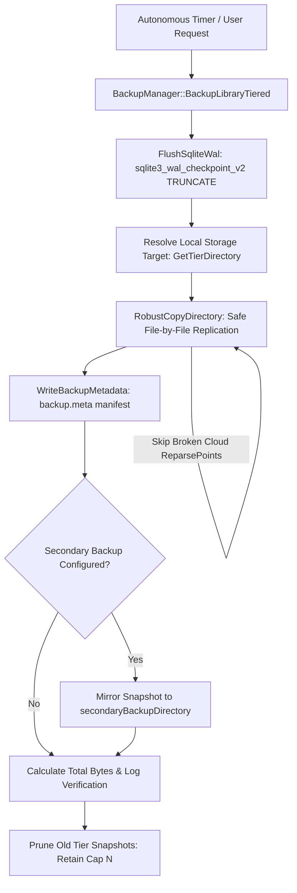

# Backup & Disaster Recovery Subsystem

## Overview
The `BackupManager` subsystem implements an autonomous, multi-tier **Grandfather-Father-Son (GFS)** backup and disaster recovery engine for FolioNote. It guarantees data preservation across system crashes, drive failures, and database corruptions while remaining completely isolated from cloud sync hazards.

---

## Directory Structure

```text
src/core/backup/
├── backup_manager.hpp          # Declarations for tiered backups, rotation policies, and asynchronous workers
└── backup_manager.cpp          # SQLite WAL flushing, robust file copying, snapshot metadata, and retention pruning
```

---

## On-Disk Storage Architecture

Backups are saved **deep within the local machine's native file system**, strictly isolated from cloud synchronization directories (like OneDrive, iCloud, or Dropbox):

* **Windows**: `%LOCALAPPDATA%\FolioNote\backups\` (e.g. `C:\Users\<user>\AppData\Local\FolioNote\backups\`)
* **Linux**: `~/.local/share/FolioNote/backups/`
* **macOS**: `~/Library/Application Support/FolioNote/backups/`

```text
%LOCALAPPDATA%/FolioNote/backups/
├── manual/                     # On-demand snapshots triggered manually via UI
└── tiers/
    ├── daily/                  # Daily snapshots (keeps rolling 7 daily backups)
    ├── weekly/                 # Weekly snapshots (keeps rolling 4 weekly backups)
    └── monthly/                # Monthly snapshots (keeps rolling 12 monthly backups)
```

Each snapshot folder is timestamped (e.g. `Default_Backup_20261009_194948/`) and contains:
1. `backup.meta`: Manifest file storing ID, source name, original path, timestamp, notebook count, and tier.
2. Complete clone of the library structure: `structure.db`, `pages/`, `imports/`, and `revisions/`.

---

## Snapshot Lifecycle & Working Process



---

## Key Resilience Features

### 1. SQLite Write-Ahead Log (WAL) Checkpointing
Before file-copying begins, `FlushSqliteWal()` scans for all `.db` files and executes:
```c
sqlite3_wal_checkpoint_v2(db, NULL, SQLITE_CHECKPOINT_TRUNCATE, &logSize, &framesCheckpointed);
```
This merges all uncommitted WAL pages into the primary database file and resets the log, completely preventing Windows file sharing violations (`ERROR_SHARING_VIOLATION`).

### 2. Cloud-Reparse-Point & Placeholder Resilience
When working libraries reside in folders linked to cloud sync utilities (e.g. OneDrive), files can become dehydrated `ReparsePoint` stubs without local content. 

`RobustCopyDirectory()` performs safe node inspection during traversal:
* Broken cloud symlinks and placeholders are identified and skipped with diagnostic warnings.
* Single-file read errors do **not** abort the backup or roll back valid library data.

### 3. Multi-Destination Mirroring
Configured in `SettingsManager` via:
* `primaryBackupDirectory`: Default local storage root.
* `secondaryBackupDirectory`: Optional mirror target (e.g. secondary internal NVMe or external backup drive).
Snapshots are created on the primary root and automatically mirrored to the secondary root simultaneously.
