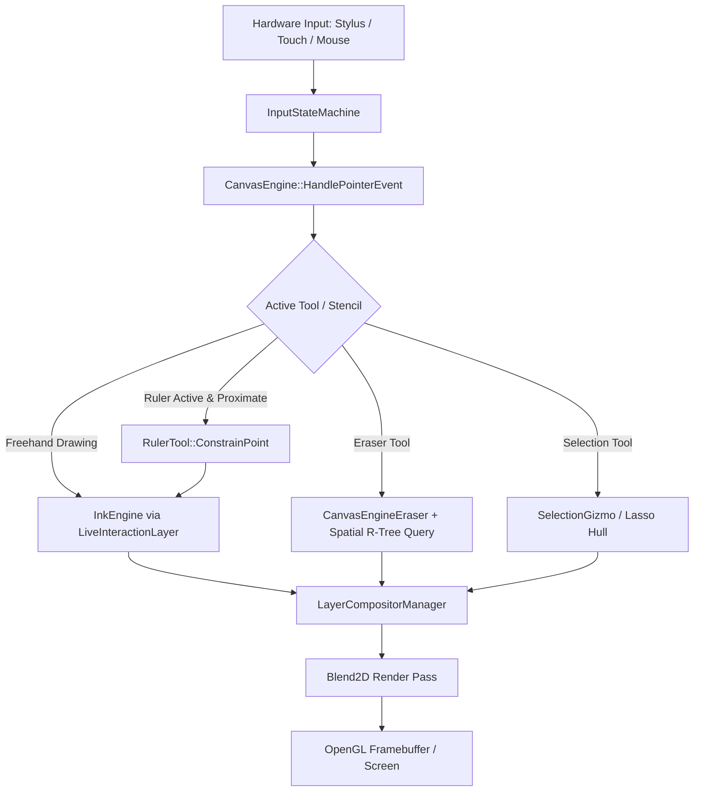

# Canvas Engine Subsystem

## Overview
The `CanvasEngine` subsystem coordinates the infinite digital drawing canvas for FolioNote. It manages world-to-screen coordinate spaces, viewport transformations (translation, zoom, rotation), canvas tiling and background rendering, and interactive drawing tools.

---

## Directory Structure

```text
src/core/canvas_engine/
├── canvas_engine.hpp               # Central coordinator managing transform, compositing, tools, and overlays
├── canvas_engine.cpp               # Lifecycle and high-level viewport orchestration
├── background/
│   ├── canvas_background_renderer.hpp # Multi-format paper backgrounds, infinity borders, and grid tiling
│   └── canvas_background_renderer.cpp
├── gizmo/
│   ├── gizmo_types.hpp             # Hit-test targets, handle states, and bounding box descriptors
│   └── selection_gizmo.hpp         # Interactive 9-point bounding box transform gizmo (scale, rotate, translate)
├── tools/
│   ├── canvas_engine_eraser.cpp    # Stroke slicing, dynamic volume erasing, and spatial collision queries
│   ├── canvas_engine_import.cpp    # Media dropping and container instantiation (images, audio, video, PDFs)
│   ├── canvas_engine_input.cpp     # Deterministic pointer event dispatching and tool arbitration
│   ├── canvas_engine_selection.cpp # Marquee selection, lasso polyline calculation, and group hit-testing
│   ├── canvas_engine_shapes.cpp    # Parametric shape drawing and recognition
│   ├── ruler_tool.hpp              # Interactive virtual straightedge ruler stencil with edge snapping
│   └── ruler_tool.cpp
└── transform/
    └── canvas_transform.hpp        # Unified 2D affine transformation matrix and viewport coordinate projector
```

---

## Architectural Data Flow



---

## Coordinate Spaces & Mathematical Transformations

FolioNote operates across two distinct 2D coordinate spaces:

1. **Screen Space** $(x_s, y_s)$ in physical device pixels (relative to top-left of the canvas viewport).
2. **World Space** $(x_w, y_w)$ in physical millimeters ($\text{mm}$).

### Forward Projection (World to Screen)
Given zoom factor $S$, camera offset $(C_x, C_y)$ in world millimeters, viewport origin $(V_x, V_y)$ in screen pixels, and display DPI scaling factor $\kappa = \frac{\text{DPI}}{25.4}$:

$$\begin{pmatrix} x_s \\ y_s \end{pmatrix} = \begin{pmatrix} (x_w - C_x) \cdot S \cdot \kappa + V_x \\ (y_w - C_y) \cdot S \cdot \kappa + V_y \end{pmatrix}$$

### Inverse Projection (Screen to World)
Converting pointer click $(x_s, y_s)$ back into canvas world space:

$$\begin{pmatrix} x_w \\ y_w \end{pmatrix} = \begin{pmatrix} \frac{x_s - V_x}{S \cdot \kappa} + C_x \\ \frac{y_s - V_y}{S \cdot \kappa} + C_y \end{pmatrix}$$

---

## Tool Subsystem

### 1. Virtual Straightedge Ruler (`tools/ruler_tool.hpp`)
* **Geometry**: $240\text{ mm} \times 52\text{ mm}$ physical straightedge with continuous angle orientation $\theta$.
* **Vector Edge Snapping**:
  Given ruler center $P_c$, unit direction vector $\hat{u} = (\cos\theta, \sin\theta)$, normal $\hat{n} = (-\sin\theta, \cos\theta)$, and half-height $h = 26\text{ mm}$:
  For any stylus position $P$, the orthogonal distance to edge $k \in \{-h, +h\}$ is:
  $$d_{\perp} = |(P - P_c) \cdot \hat{n} - k|$$
  If $d_{\perp} \le 6.5\text{ mm}$, the point is snapped onto the edge:
  $$P_{\text{snapped}} = P - ((P - P_c) \cdot \hat{n} - k) \hat{n}$$
* **Protractor HUD**: Center angle dial supporting $15^\circ$ detent snapping and live drawn-length readout.

### 2. Eraser Engine (`tools/canvas_engine_eraser.cpp`)
* **Stroke Eraser**: Deletes entire stroke primitives intersecting the eraser circle.
* **Dynamic Eraser**: Cuts and divides continuous spline paths into multiple independent sub-strokes via narrowphase line-segment collision testing.

### 3. Selection & Gizmo (`gizmo/selection_gizmo.hpp`)
* 9-point affine bounding box supporting scale, shear, rotation, and translation of grouped canvas objects.
