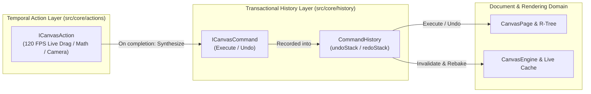

# History & Undo/Redo Subsystem (`src/core/history`)

## Overview

The `history` subsystem provides a transactional, deterministic, and bounded **Undo/Redo** mechanism for FolioNote. It implements the classic **GoF Command Pattern** where every discrete canvas mutation is encapsulated into a reversible, self-contained object.

---

## Architecture & Subsystem Division

### Distinction: Actions vs. Commands
* **`ICanvasAction` (`src/core/actions/`):** Temporal, active operations that run across multiple frames at 120+ FPS (e.g., stylus drag, continuous rotation, live parametric curve evaluation, spring easing). Manages transient visual preview state.
* **`ICanvasCommand` (`src/core/history/`):** Discrete, atomic, and retroactive state records. When an `ICanvasAction` finishes, it constructs a single `ICanvasCommand` and records it into `CommandHistory`.

---

## Core Components

| File | Purpose |
|---|---|
| [`canvas_command.hpp`](file:///home/odysseus/Documents/GitHub/FolioNote/src/core/history/canvas_command.hpp) | Declares the abstract `ICanvasCommand` interface and all 10 concrete command classes. |
| [`canvas_command.cpp`](file:///home/odysseus/Documents/GitHub/FolioNote/src/core/history/canvas_command.cpp) | Implements forward (`Execute`) and reverse (`Undo`) execution logic with centralized cache invalidation. |
| [`command_history.hpp`](file:///home/odysseus/Documents/GitHub/FolioNote/src/core/history/command_history.hpp) | Declares the per-page `CommandHistory` stack manager enforcing bounded memory limits. |
| [`command_history.cpp`](file:///home/odysseus/Documents/GitHub/FolioNote/src/core/history/command_history.cpp) | Implements stack recording, depth bounding, undo, redo, and state clearing. |

---

## Concrete Command Catalog

| Command | Mutation Type | Execute Behavior | Undo Behavior |
|---|---|---|---|
| `AddObjectCommand` | Single object insert | Adds object to page, makes visible, clears selection. | Removes object from page, marks invisible. |
| `AddObjectsCommand` | Multi-object insert | Batch-adds objects (e.g. paste, duplicate). | Batch-removes objects. |
| `RemoveObjectsCommand` | Multi-object delete | Removes objects from page (delete key, cut). | Re-adds objects to page. |
| `BatchEraseCommand` | Continuous eraser | Removes deleted strokes, adds sliced fragments. | Restores original stroke, removes fragments. |
| `TransformObjectsCommand` | Translation, scale, rotate | Replaces objects with post-transform clones. | Restores pre-transform clones. |
| `GroupObjectsCommand` | Logical grouping | Assigns shared `groupId` to selected objects. | Restores previous individual group IDs. |
| `UngroupObjectsCommand` | Break grouping | Clears `groupId` across selected objects. | Restores previous group IDs. |
| `MacroCommand` | Composite transaction | Executes a series of sub-commands forward. | Reverses sub-commands in reverse order. |
| `LockObjectsCommand` | Background template lock | Sets `isLocked=true`, `isSelectable=false`, `zOrder=0`. | Restores original lock, selectivity, and z-order. |
| `ModifyTextCommand` | Text edit & reflow | Updates string, re-layouts text box, updates R-Tree. | Restores prior string, bounds, and R-Tree entry. |
| `RelinkAttachmentCommand` | Attachment file path | Replaces file path, display name, checks validity. | Restores prior path and display name. |

---

## Invariants & Design Rules

1. **Deterministic Bounded Memory:**
   `CommandHistory` enforces a maximum depth (`maxHistoryDepth = 100` by default). When exceeded, the oldest undo record is popped, guaranteeing predictable memory consumption.
2. **Redo Stack Invalidation:**
   Recording any new command (`RecordCommand` or `ExecuteCommand`) clears the `redoStack` immediately.
3. **Cache Invalidation:**
   Every `Execute()` and `Undo()` invocation marks `engine->isDirty = true` and `engine->needsFullRebake = true`, ensuring that `BakedCanvasLayer` re-renders accurately.
4. **Spatial Index Consistency:**
   Commands that modify object bounds or visibility synchronize with `CanvasPage::spatialIndex` (R-Tree) so spatial hit testing remains consistent.
