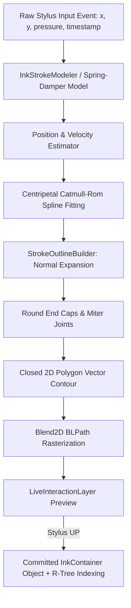

# Ink Engine Subsystem

## Overview
The `InkEngine` subsystem powers low-latency, physics-based digital ink generation, real-time spline interpolation, 2D polygon contour meshing, and spatial stroke collision detection.

---

## Directory Structure

```text
src/core/ink_engine/
├── ink_engine.hpp              # High-level coordinator managing live inking sessions and stroke lifecycles
├── ink_engine.cpp              # Implementation connecting smoothing, meshing, and layer commit
├── stroke_smoother.hpp         # Hardware telemetry filtering, spring-damper physics, and spline generation
├── stroke_outline_builder.hpp  # Variable-thickness 2D polygon contour tessellation
└── stroke_collision.hpp        # Broadphase AABB & narrowphase geometric intersection testing
```

---

## Inking Data Pipeline



---

## Mathematical Foundations

### 1. Physics-Based Smoothing (Spring-Mass-Damper)
Raw digitizer events undergo continuous spring-damper simulation to filter jitter and high-frequency hardware noise:

$$m \ddot{x} + c \dot{x} + k(x - x_{\text{target}}) = 0$$

Where:
* $k$ is the spring stiffness constant (controls responsiveness/tracking).
* $c = 2\sqrt{km}$ is critical damping (prevents unnatural oscillation or overshoot).

### 2. Centripetal Catmull-Rom Spline Interpolation
To avoid self-intersections and cusp loops during sharp turns, knot parameters $t_i$ are calculated with $\alpha = 0.5$ (centripetal parameterization):

$$t_{i+1} = t_i + ||P_{i+1} - P_i||^{0.5}$$

Given four consecutive points $P_0, P_1, P_2, P_3$ and normalized parameter $u \in [0, 1]$:
$$P(u) = \frac{1}{2} \begin{pmatrix} 1 & u & u^2 & u^3 \end{pmatrix} \begin{pmatrix} 0 & 2 & 0 & 0 \\ -\alpha & 0 & \alpha & 0 \\ 2\alpha & \alpha-6 & 6-2\alpha & -\alpha \\ -\alpha & 4-\alpha & \alpha-4 & \alpha \end{pmatrix} \begin{pmatrix} P_0 \\ P_1 \\ P_2 \\ P_3 \end{pmatrix}$$

### 3. Variable-Width Contour Meshing
Given center-line tangent $\vec{T} = \frac{d P(u)}{du}$, the unit normal vector is:

$$\hat{N} = \frac{(-T_y, T_x)}{\sqrt{T_x^2 + T_y^2}}$$

For localized pressure $p \in [0, 1]$ and base stroke radius $R$:
$$\text{radius}(u) = R \cdot (p_{\text{min}} + (1 - p_{\text{min}}) \cdot p^\gamma)$$

Left and right boundary vertices are generated as:
$$V_{\text{left}}(u) = P(u) + \text{radius}(u) \cdot \hat{N}$$
$$V_{\text{right}}(u) = P(u) - \text{radius}(u) \cdot \hat{N}$$

End caps are formed by tessellating a semi-circular fan across 16 segments from $-\hat{N}$ through $\hat{T}$ to $+\hat{N}$.

---

## Collision & Erasure Mechanics (`stroke_collision.hpp`)
* **Broadphase**: Evaluates overlap between the eraser's circular bounding box and the stroke's minimum bounding box (AABB).
* **Narrowphase**: Performs segment-to-circle distance checks for every polyline segment:
  $$d_{\text{segment}}(Q, A, B) = ||Q - (A + \text{clamp}(t, 0, 1) \cdot (B - A))||$$
  Where $t = \frac{(Q - A) \cdot (B - A)}{||B - A||^2}$.
