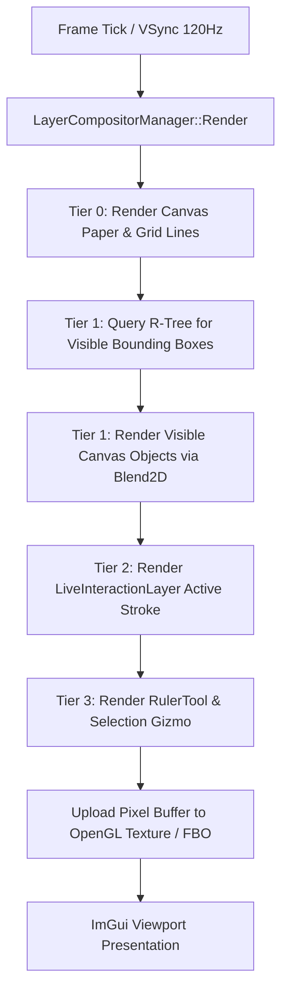

# Layer Compositor Subsystem

## Overview
The `LayerCompositorManager` manages a 4-tier rendering pipeline designed for low-latency hardware inking and smooth 120 FPS canvas interaction. It decouples high-frequency active pen strokes from heavy static canvas objects, ensuring that active handwriting never stutters during complex page rendering.

---

## Directory Structure

```text
src/core/layers/
├── layer_compositor_manager.hpp # Central coordinator managing multi-layer blending and dirty rects
├── layer_compositor_manager.cpp # Render pass dispatching and Blend2D context preparation
├── baked_canvas_layer.hpp       # Render target for committed static objects (ink, shapes, text, media)
├── baked_canvas_layer.cpp
├── live_interaction_layer.hpp   # Fast uncommitted live inking layer wired directly to InkEngine
├── live_interaction_layer.cpp
├── embedded_app_layer.hpp       # HWND / WebView / GLES embedded web container layer
└── embedded_app_layer.cpp
```

---

## 4-Tier Compositor Pipeline

```text
================================================================================
 Tier 3: Stencil & Interactive Overlay Layer
   - Virtual Straightedge Ruler (RulerTool)
   - Selection Bounding Box & 9-point Gizmo handles
   - Lasso polyline and marquee selection rectangles
================================================================================
 Tier 2: Live Interaction Layer (Direct Hardware Inking)
   - Active inking stroke currently under the stylus tip (0ms latency path)
   - Real-time dynamic eraser preview circle
   - In-progress geometric shape drag preview
================================================================================
 Tier 1: Baked Canvas Layer (Static Object Scene)
   - Committed ink strokes (InkContainer)
   - Geometric vectors (ShapeContainer, SmartArrowContainer)
   - Text boxes, images, PDF pages, audio chips, video cards
   - Spatial R-Tree acceleration & view-frustum culling
================================================================================
 Tier 0: Background Layer
   - Paper textures, page boundaries, grid lines, and dot-matrices
================================================================================
```

---

## Compositing Flow & Frame Pacing



---

## Why Decoupled Layers Matter for Latency
1. **Zero Garbage Collection / Allocation during Inking**: The live stroke is maintained as a contiguous coordinate stream inside `LiveInteractionLayer` without touching the database or R-Tree until stylus lift (`Stylus UP`).
2. **Independent Invalidation**: When drawing a new stroke, the `BakedCanvasLayer` does not need to re-rasterize thousands of existing strokes on the page. Only the live stroke layer is repainted.
3. **Seamless Commit**: Upon stylus lift, `LiveInteractionLayer::CommitStroke()` transfers the vector geometry into an `InkContainer`, registers it into the R-Tree spatial index, and bakes it into `BakedCanvasLayer`.
