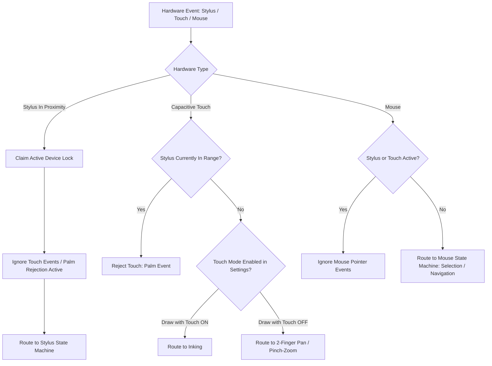

# Input Subsystem

## Overview
The `input` subsystem coordinates hardware digitizers, pen pressure sensors, capacitive multi-touch surfaces, and standard mice. It guarantees deterministic hardware arbitration, palm rejection, and seamless state-machine transitions across drawing, selection, and viewport navigation.

---

## Directory Structure

```text
src/input/
├── input_manager.hpp             # Hardware event ingestion, timestamping, and device registration
├── input_manager.cpp
├── pen_palette.hpp               # Color models, stroke thicknesses, and pen nib presets (Pen, Pencil, Brush, Fountain)
├── preset_manager.hpp            # Binding to persistent pen presets in SettingsManager
├── stateMachine/
│   ├── input_state_machine.hpp   # Central state machine routing events based on device priority
│   ├── input_state_machine.cpp
│   ├── input_state_machine_mouse.cpp  # Dedicated mouse event handling (drag, lasso, right-click menu)
│   ├── input_state_machine_stylus.cpp # High-frequency stylus handling (pressure, tilt, barrel button, eraser tip)
│   ├── input_state_machine_touch.cpp  # Multi-touch gesture processing (pinch-to-zoom, two-finger pan)
│   ├── pointer_icon_manager.hpp  # OS cursor synchronization (crosshair, pen, grab hand, resize arrows)
│   ├── pointer_icon_manager.cpp
│   └── special_action_manager.hpp # Gesture shortcuts (undo tap, quick lasso, double-tap zoom)
```

---

## Hardware Arbitration & Priority Hierarchy

FolioNote enforces a strict **deterministic hardware priority hierarchy** to eliminate input contention and accidental palm triggers:

$$\text{Active Stylus (Priority 1)} \gg \text{Capacitive Touch (Priority 2)} \gg \text{Mouse (Priority 3)}$$



---

## Palm Rejection Mechanics
1. **Hover Detection**: When an active EMR/AES stylus enters detection range ($\approx 10\text{ mm}$ above the digitizer glass), Windows/SDL reports proximity. Touch processing is suspended immediately.
2. **Release Hysteresis**: After the stylus lifts from the glass, touch events are ignored for an 80ms cooldown period ($\Delta t_{\text{hysteresis}} = 80\text{ ms}$) to prevent the heel of the palm from registering a touch when lifting the pen.
3. **UI Interaction Lock**: When ImGui overlays (ribbon, modals, color pickers) have mouse capture, all canvas inking is suspended.
