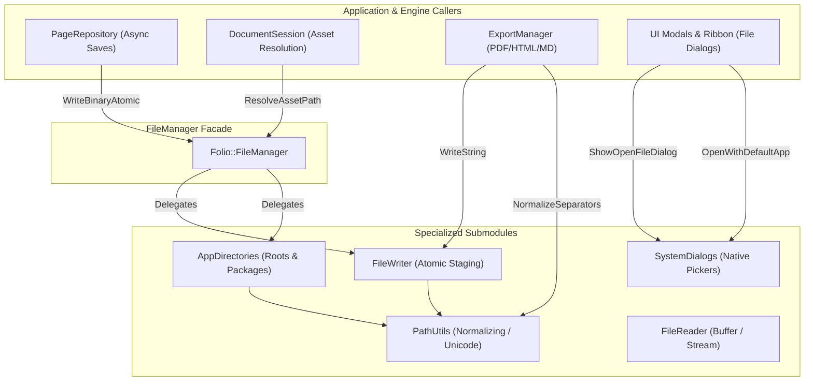
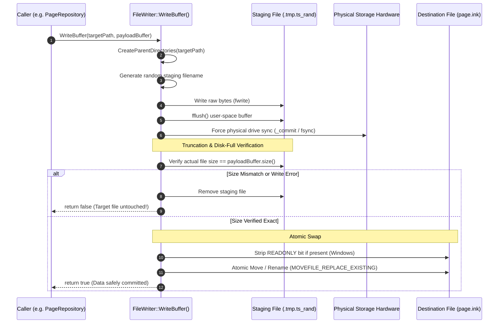

# FolioNote I/O & File Management Subsystem

> **Location:** `src/io/`  
> **Architecture Pattern:** Decoupled Facade & Focused Domain Services  
> **Target Platforms:** Windows (Win32/NTFS), Linux (POSIX), macOS (Darwin), Android (App Sandbox)

---

## 1. Overview & Architectural Role

The `src/io/` module provides a unified, cross-platform filesystem and persistence abstraction layer for FolioNote. It insulates domain subsystems (such as `DocumentSession`, `PageRepository`, `CanvasPage`, and `ExportManager`) from operating system divergences:

1. **Unicode & International Encoding:** Seamless UTF-8 to UTF-16 conversion on Windows, bypassing MSVC ANSI code page limits and the legacy 260-character `MAX_PATH` constraint.
2. **Crash-Resilient Atomic Writes:** Two-phase staging and physical drive synchronization (`fsync` / `_commit`) preventing document truncation or corruption during sudden power loss or crashes.
3. **Platform Sandboxing & Asset Resolution:** Abstracting differences between Desktop document folders (`SDL_FOLDER_DOCUMENTS`) and Android sandboxed internal directories (`SDL_GetPrefPath`).
4. **Native Desktop Integration:** Cross-platform file pickers, default system application launching, and system clipboard bridge.

```
                     ┌─────────────────────────────────────────────────────────┐
                     │              Folio::FileManager (Facade)                │
                     │                 [io/file_manager.hpp]                   │
                     └─────────┬───────────┬────────────┬─────────────┬────────┘
                               │           │            │             │
                 ┌─────────────┴──┐  ┌─────┴──────┐ ┌───┴──────────┐  │
                 │   PathUtils    │  │  AppDirs   │ │  SysDialogs  │  │
                 │ [path_utils.*] │  │[app_dirs.*]│ │[sys_dialogs.*│  │
                 └────────────────┘  └────────────┘ └──────────────┘  │
                                                                      │
                               ┌──────────────────────────────────────┴┐
                               │       FileReader   &   FileWriter     │
                               │    [file_reader.*]   [file_writer.*]  │
                               └───────────────────────────────────────┘
```

---

## 2. File-by-File Catalog & Overview

| Header | Implementation | Lines | Primary Responsibility |
| :--- | :--- | :--- | :--- |
| [`file_manager.hpp`](file_manager.hpp) | [`file_manager.cpp`](file_manager.cpp) | ~250 / ~280 | **Master Coordinator & Facade:** Exposes the full public API to ~240 call sites; implements directory tree copies, moves, listing, and deletions. |
| [`path_utils.hpp`](path_utils.hpp) | [`path_utils.cpp`](path_utils.cpp) | ~95 / ~210 | **Pure Path Mathematics & Unicode:** Native path conversions (`Utf8ToNativePath`), long-path `\\?\` prefixing, separator canonicalization, file URI formatting, and path sanitization. |
| [`app_directories.hpp`](app_directories.hpp) | [`app_directories.cpp`](app_directories.cpp) | ~70 / ~115 | **Standard Application Paths:** Resolves user document roots (`FolioNote/`), config, cache, export, and log folders; manages thread-safe active package root and asset path resolution. |
| [`system_dialogs.hpp`](system_dialogs.hpp) | [`system_dialogs.cpp`](system_dialogs.cpp) | ~40 / ~190 | **Native OS Shell & Dialogs:** Modal file pickers (`GetOpenFileNameW`, AppleScript, `zenity`/`kdialog`) and `OpenWithDefaultApp` (`SDL_OpenURL` + `ShellExecuteW`). |
| [`file_writer.hpp`](file_writer.hpp) | [`file_writer.cpp`](file_writer.cpp) | ~40 / ~230 | **Atomic Persistence Service:** Crash-resilient file writing with `.tmp` staging, retry loop for Windows antivirus/cloud locks, physical sync (`_commit`/`fsync`), and atomic replacement. |
| [`file_reader.hpp`](file_reader.hpp) | [`file_reader.cpp`](file_reader.cpp) | ~100 / ~390 | **Asset Loading & Memory Mapping:** Zero-copy `MemoryMappedView` (`mmap` / `MapViewOfFile`), UTF-8 text/binary reads, `SDL_IOStream` virtual streams, 64-bit FNV-1a hashing, and fast PDF page count detection. |
| [`file_logger.hpp`](file_logger.hpp) | *(Header-only)* | ~190 | **Diagnostic Logging Sink:** Session file logging with size-based log file rotation and timestamped entries. |
| [`package_marker.hpp`](package_marker.hpp) | *(Header-only)* | ~145 | **Package Integrity Validator:** Validates `.fn` notebook directory structures and markers. |

---

## 3. Subsystem Interactions & Data Flow

### 3.1 Domain Call Sites vs I/O Submodules



---

### 3.2 Crash-Resilient Atomic Write Lifecycle (`FileWriter`)

When persisting critical page data (`.ink`), SQLite database files, or configuration manifests, `FileWriter` ensures complete isolation against power outages or crashes:



---

## 4. Platform-Specific Implementations

### Windows (Win32 / NTFS)
- **Extended Path Prefixing (`\\?\`):** Deeply nested notebook section folders and UUIDs can easily exceed the legacy Win32 `MAX_PATH` (260 characters). `PathUtils::Utf8ToNativePath` automatically injects the `\\?\` prefix for paths with $\ge 240$ characters.
- **Read-Only Overwrite Protection:** `MoveFileExW(..., MOVEFILE_REPLACE_EXISTING)` fails with `ERROR_ACCESS_DENIED` if the destination file has `FILE_ATTRIBUTE_READONLY` set (common with cloud-synced folders like OneDrive, Google Drive, or Git checkouts). `PathUtils::EnsureTargetWritable` strips this attribute prior to atomic rename.
- **Physical Sync:** Uses `_commit(_fileno(fp))` to flush hardware write buffers.

### POSIX (Linux / macOS / Android)
- **UTF-8 Native:** Filesystem paths are treated directly as canonical UTF-8 byte streams.
- **Physical Sync:** Uses `fsync(fileno(fp))`.
- **Desktop Portals:** Linux file dialogs dynamically detect and invoke `zenity` or `kdialog`. macOS uses AppleScript modal calls to `NSOpenPanel`/`NSSavePanel`.
- **Android Sandboxing:** Bypasses inaccessible `/` paths by querying `SDL_GetPrefPath("UniversalFramework", "FolioNote")`.

---

## 5. Developer Usage Guidelines

1. **Use Targeted Headers Where Possible:**
   - If a file only needs path math (e.g. `JoinPath`, `GetFileName`), include `#include "io/path_utils.hpp"` instead of the entire `FileManager`.
   - If a file only saves data, use `#include "io/file_writer.hpp"` (or alias `FileSaver`).
   - If a file only loads assets, use `#include "io/file_reader.hpp"` (or alias `FileLoader`).
2. **Backward Compatibility:**
   - Existing code calling `FileManager::JoinPath()`, `FileManager::WriteTextAtomic()`, etc. remains 100% valid. `FileManager` inline-forwards to the appropriate specialized service.
3. **Never Overwrite Files Directly via `std::ofstream(..., trunc)`:**
   - Always persist user documents and settings through `FileWriter::WriteString()` or `FileWriter::WriteBuffer()` to prevent file corruption in case of unexpected termination.

