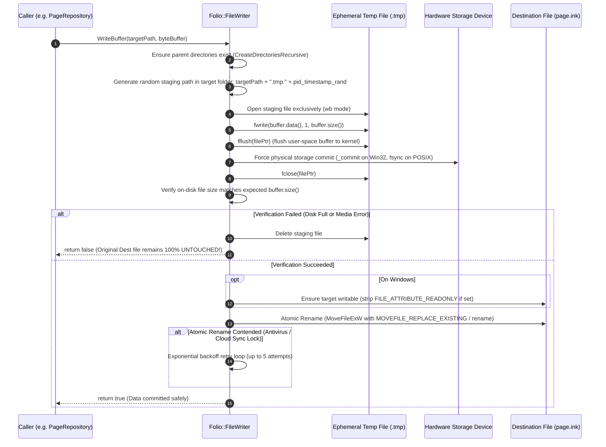

# FolioNote I/O & Filesystem Architecture

> **Subsystem Location:** `src/io/`  
> **Architectural Pattern:** Subsystem Facade & Focused Domain Services  
> **Key Invariant:** Zero Data Loss Under Crash, Sudden Termination, or Power Loss  
> **Target Platforms:** Windows (Win32/NTFS), Linux (POSIX), macOS (Darwin), Android (App Sandbox)

---

## 1. Architectural Philosophy & User Data Safeguards

The `src/io/` subsystem is the foundation of user data persistence in FolioNote. In a digital notebook and vector inking application, **user trust is indivisible from data integrity**. If an application crashes, freezes, or experiences sudden power loss during a stroke persistence or metadata save, the user's handwritten notes, drawings, and documents must never be left truncated, corrupted, or zero-byte wiped.

To guarantee zero data loss, the I/O layer enforces four mandatory operational pillars:

1. **Two-Phase Crash-Resilient Atomic Persistence:** Direct truncation (`std::ofstream(..., std::ios::trunc)`) is strictly forbidden across the codebase. All writes stage to an ephemeral randomized temporary file, physically synchronize hardware drive platters/flash via `_commit` or `fsync`, verify exact byte lengths, and perform an OS-level atomic replace.
2. **Unicode & Path Mathematics Without Limits:** Windows legacy ANSI APIs and standard C runtimes are constrained by `MAX_PATH` (260 characters) and system locale code pages. `PathUtils` normalizes paths to UTF-8 internally, converts to UTF-16 wide strings for Win32 NT kernel calls, and transparently applies `\\?\` extended path prefixing for deeply nested notebook structures.
3. **High-Performance Zero-Copy Ingestion:** Large media attachments, vector strokes, and PDF documents are ingested through memory-mapped I/O views (`MapViewOfFile` on Win32, `mmap` on POSIX), eliminating redundant heap allocations and enabling instant file hashing (FNV-1a 64-bit).
4. **Clean Subfolder Domain Isolation:** Implementation files are organized into dedicated subfolders (`facade/`, `paths/`, `storage/`, `platform/`), keeping each module focused, robust, and easily maintainable without monolithic clutter.

---

## 2. Directory Layout & Module Organization

```text
src/io/
├── README.md                      # Comprehensive user data architecture & filesystem guide
├── facade/                        # Subsystem facade and high-level directory tree operations
│   ├── file_manager.hpp           # Unified entry point for filesystem operations
│   └── file_manager.cpp           # Tree traversals, recursive copy, move, and directory mutations
├── paths/                         # Path arithmetic, Unicode conversion, and OS directories
│   ├── path_utils.hpp             # UTF-8/UTF-16 wide conversion, long path (\\?\), normalization
│   ├── path_utils.cpp             # Path mathematical algorithms and Windows NT prefix handling
│   ├── app_directories.hpp        # Resolution of document roots, config, cache, and log paths
│   └── app_directories.cpp        # Thread-safe standard OS path discovery and active package roots
├── storage/                       # Crash-resilient file persistence, mmap streaming, and logging
│   ├── file_writer.hpp            # Atomic two-phase write API (.tmp staging, fsync)
│   ├── file_writer.cpp            # Low-level write staging, _commit/fsync, and atomic swap implementation
│   ├── file_reader.hpp            # MemoryMappedView, UTF-8 text/binary reads, FNV-1a hashing
│   ├── file_reader.cpp            # Zero-copy memory mapping and cross-platform read implementations
│   └── file_logger.hpp            # Rotating file logging sink with in-memory ring-buffer
└── platform/                      # Native OS shell integrations and package branding
    ├── system_dialogs.hpp         # Native OS file dialogs and shell URL launchers
    ├── system_dialogs.cpp         # Win32 GetOpenFileNameW/ShellExecuteW, Linux zenity, macOS AppleScript
    └── package_marker.hpp         # Windows Explorer desktop.ini branding for .notebook packages
```

---

## 3. Subsystem Domain Catalog

### 3.1 Facade Layer (`src/io/facade/`)

| File | Type | Lines | Role & Responsibilities |
| :--- | :--- | :--- | :--- |
| [`file_manager.hpp`](file:///c:/SoftwareDevelopment/FolioNote/src/io/facade/file_manager.hpp) | Header | ~250 | Public subsystem facade exposing all operations to application domains (`PageRepository`, `DocumentSession`, `ExportManager`, etc.). Retains backward compatibility for all calls. |
| [`file_manager.cpp`](file:///c:/SoftwareDevelopment/FolioNote/src/io/facade/file_manager.cpp) | Source | ~280 | Implements recursive directory tree cloning (`CopyDirectoryTree`), folder removal (`RemoveDirectoryRecursive`), directory enumeration (`ListEntries`), and equivalence checks. |

### 3.2 Paths & Environmental Abstraction (`src/io/paths/`)

| File | Type | Lines | Role & Responsibilities |
| :--- | :--- | :--- | :--- |
| [`path_utils.hpp`](file:///c:/SoftwareDevelopment/FolioNote/src/io/paths/path_utils.hpp) | Header | ~95 | Defines path canonicalization, delimiter normalization (`\` $\rightarrow$ `/`), base name/extension extraction, parent navigation, and UTF-8 $\leftrightarrow$ UTF-16 wide string transformations. |
| [`path_utils.cpp`](file:///c:/SoftwareDevelopment/FolioNote/src/io/paths/path_utils.cpp) | Source | ~215 | Implements NT extended-length prefixing (`\\?\`), trailing separator stripping, multi-segment joins, and read-only attribute clearing on Windows. |
| [`app_directories.hpp`](file:///c:/SoftwareDevelopment/FolioNote/src/io/paths/app_directories.hpp) | Header | ~85 | Declares resolution methods for application roots (`FolioNote/`), user libraries (`Libraries/`), configuration (`config.json`), cache, exports, and active package roots. |
| [`app_directories.cpp`](file:///c:/SoftwareDevelopment/FolioNote/src/io/paths/app_directories.cpp) | Source | ~225 | Thread-safe resolution of OS folders (`SHGetKnownFolderPath` on Windows, `SDL_GetPrefPath` on Android/POSIX); manages active notebook package relative paths. |

### 3.3 Disk Persistence & Streaming (`src/io/storage/`)

| File | Type | Lines | Role & Responsibilities |
| :--- | :--- | :--- | :--- |
| [`file_writer.hpp`](file:///c:/SoftwareDevelopment/FolioNote/src/io/storage/file_writer.hpp) | Header | ~45 | Core atomic persistence contract: `WriteString`, `WriteBuffer`, `CreateParentDirectories`. |
| [`file_writer.cpp`](file:///c:/SoftwareDevelopment/FolioNote/src/io/storage/file_writer.cpp) | Source | ~235 | Two-phase staging execution: stages to `.tmp.<ts>_<rand>`, flushes OS cache (`fflush`), forces physical disk write (`_commit`/`fsync`), verifies byte count, clears readonly attributes, and swaps via `MoveFileExW` / `rename`. Includes retry loops for cloud-synced / antivirus lock contention. |
| [`file_reader.hpp`](file:///c:/SoftwareDevelopment/FolioNote/src/io/storage/file_reader.hpp) | Header | ~100 | Zero-copy `MemoryMappedView` abstraction, binary and string loading, stream wrapping (`SDL_IOStream`), FNV-1a 64-bit hashing, and fast PDF trailer parsing. |
| [`file_reader.cpp`](file:///c:/SoftwareDevelopment/FolioNote/src/io/storage/file_reader.cpp) | Source | ~395 | Win32 `CreateFileW`/`CreateFileMappingW`/`MapViewOfFile` and POSIX `open`/`mmap` zero-copy memory mapping, FNV-1a hash calculation, and fast PDF page counting. |
| [`file_logger.hpp`](file:///c:/SoftwareDevelopment/FolioNote/src/io/storage/file_logger.hpp) | Header | ~210 | High-performance thread-safe session logger with size-based log file rotation (`folionote_<session>.log`) and in-memory ring-buffer cache for the in-app debug overlay. |

### 3.4 Platform Shell & OS Integrations (`src/io/platform/`)

| File | Type | Lines | Role & Responsibilities |
| :--- | :--- | :--- | :--- |
| [`system_dialogs.hpp`](file:///c:/SoftwareDevelopment/FolioNote/src/io/platform/system_dialogs.hpp) | Header | ~40 | Modal file picker dialogs (`ShowOpenFileDialog`, `ShowSaveFileDialog`) and external application launching (`OpenWithDefaultApp`). |
| [`system_dialogs.cpp`](file:///c:/SoftwareDevelopment/FolioNote/src/io/platform/system_dialogs.cpp) | Source | ~190 | Native OS implementations: Win32 `GetOpenFileNameW` / `ShellExecuteW`, macOS AppleScript `choose file`, and Linux `zenity` / `kdialog`. |
| [`package_marker.hpp`](file:///c:/SoftwareDevelopment/FolioNote/src/io/platform/package_marker.hpp) | Header | ~150 | Windows Explorer folder package customizer: generates hidden/system `desktop.ini`, applies `FILE_ATTRIBUTE_READONLY` on directory packages, and broadcasts `SHChangeNotify` so `.notebook` packages render with custom icons. |

---

## 4. Deep-Dive: Two-Phase Atomic Write Lifecycle

### 4.1 The Peril of In-Place File Overwrite
In standard C++ desktop applications, naive file writing looks like this:
```cpp
// DANGEROUS: DO NOT DO THIS
std::ofstream out(filePath, std::ios::trunc | std::ios::binary);
out.write(data, size);
```
If an OS crash, kernel panic, power failure, or process termination occurs during `out.write()`, the file on disk is left at **0 bytes** or partially truncated. **The user's original file was destroyed the instant `std::ios::trunc` opened it.**

### 4.2 FolioNote Crash-Resilient Sequence
`Folio::FileWriter` eliminates this failure mode completely through a strict 7-step atomic protocol:



### 4.3 Key Safety Invariants:
1. **Colocated Staging:** The staging file is *always* generated in the exact same directory as the target file. This ensures that the staging file and target file reside on the **same physical filesystem partition/volume**, guaranteeing that the rename operation is an atomic metadata directory inode/MFT pointer swap, rather than a slow multi-block copy across volumes.
2. **Physical Cache Eviction:** Flushing user-space buffers via `fflush()` is insufficient; modern operating systems and solid-state drives buffer writes in OS disk cache and drive DRAM. `_commit()` (Windows) and `fsync()` (POSIX) force the physical drive controller to flush write-back caches to non-volatile NAND/platter storage before the directory pointer is updated.
3. **Antivirus & Cloud Sync Lock Resilience:** On Windows, services such as Windows Defender, OneDrive, Dropbox, or Google Drive frequently lock newly written files momentarily to calculate hashes. `FileWriter` incorporates a 5-attempt retry loop with exponential sleep backoff, avoiding transient `ERROR_ACCESS_DENIED` failures.

---

## 5. Unicode & Path Engineering (Windows `MAX_PATH` & POSIX)

### 5.1 The Win32 `MAX_PATH` Challenge
On Windows, standard Win32 ANSI and narrow filesystem APIs restrict path lengths to `MAX_PATH = 260` characters. In FolioNote, notebook hierarchies can be deeply nested:
```text
C:\Users\<Username>\Documents\FolioNote\Libraries\My Research Library.foliolib\
Sections\Computer Science\subsections\Machine Learning\
pages\3f8a4e12-b98a-4d22-95f7-649033320c15\page.ink
```
Such paths easily exceed 260 characters. If an application uses narrow `std::string` paths with standard `fopen()` or `GetFileAttributesA()`, operations fail with path-not-found or invalid-parameter errors.

### 5.2 Extended Path Transformation (`\\?\`)
`PathUtils::Utf8ToNativePath()` resolves this transparently:
1. Translates the UTF-8 string into a UTF-16 wide string (`std::wstring`) using `MultiByteToWideChar(CP_UTF8, ...)`.
2. Normalizes all path separators to backslashes (`\`).
3. If the path is an absolute drive path (e.g. `C:\...`) and its length exceeds 240 characters (or if it contains non-ASCII characters), it automatically prepends the Win32 NT extended-length path prefix:
   $$\text{Prefix} = \texttt{\textbackslash\textbackslash?\textbackslash}$$
   Extending the maximum permissible path length from **260 characters to 32,767 characters**.
4. When paths are returned from the OS to application callers, `PathUtils::NativePathToUtf8()` strips the `\\?\` prefix and normalizes separators to forward slashes (`/`), maintaining canonical presentation throughout the UI and internal logs.

---

## 6. High-Performance Zero-Copy File Ingestion (`FileReader`)

### 6.1 Memory-Mapped Views (`MemoryMappedView`)
For large binary stroke databases, high-resolution background images, audio/video attachments, and PDF files, copying multi-megabyte payloads through `std::ifstream` creates massive heap fragmentation and GC pauses.

`FileReader::MapReadOnly()` maps files directly into the process's virtual address space:
- **Windows:** `CreateFileW(..., GENERIC_READ, FILE_SHARE_READ)` $\rightarrow$ `CreateFileMappingW(..., PAGE_READONLY)` $\rightarrow$ `MapViewOfFile(..., FILE_MAP_READ)`.
- **POSIX:** `open(..., O_RDONLY)` $\rightarrow$ `mmap(..., PROT_READ, MAP_SHARED)`.

The resulting `MemoryMappedView` provides direct pointer access (`const uint8_t* data`, `size_t size`) without copying a single byte into user RAM. Pages are paged in lazily by the OS virtual memory manager directly from physical storage.

### 6.2 64-Bit FNV-1a Fast Hash Calculation
FolioNote uses zero-copy FNV-1a hashing for asset deduplication and package validation:

$$\text{hash} = \text{offset\_basis} = 14695981039346656037\text{ULL}$$
$$\text{For each byte } b \in \text{data}: \quad \text{hash} = (\text{hash} \oplus b) \times 1099511628211\text{ULL}$$

Through `FileReader::ComputeHash64()`, the file is memory-mapped and hashed in a single tight assembly loop with zero heap allocation, sustaining throughputs in excess of 1.5 GB/s on modern NVMe drives.

---

## 7. Developer Rules & Best Practices

1. **Always Use `FileWriter` for Persistence:**
   ```cpp
   // CORRECT: Crash-resilient atomic persist
   Folio::FileWriter::WriteBuffer(targetPath, byteBuffer);
   
   // INCORRECT: Corrupts user files on sudden crash
   std::ofstream out(targetPath);
   out << data;
   ```

2. **Use Targeted Submodule Headers Where Specific:**
   - For pure path manipulation: `#include "io/paths/path_utils.hpp"`
   - For application folders and package roots: `#include "io/paths/app_directories.hpp"`
   - For saving files atomically: `#include "io/storage/file_writer.hpp"`
   - For reading assets and mmap: `#include "io/storage/file_reader.hpp"`
   - For full coordinator access: `#include "io/facade/file_manager.hpp"`

3. **Never Construct Hardcoded Absolute Paths:**
   Always resolve paths relative to `AppDirectories::GetAppRootDirectory()`, `AppDirectories::GetLibrariesDirectory()`, or the active package root via `AppDirectories::ResolvePackageAssetPath()`.
