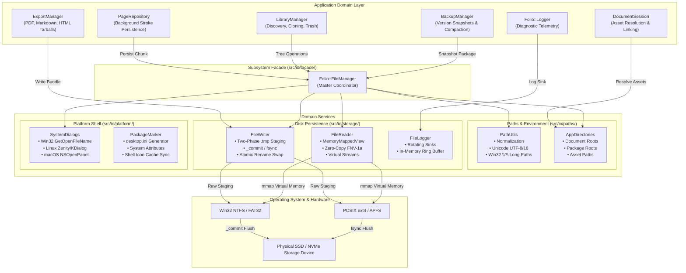
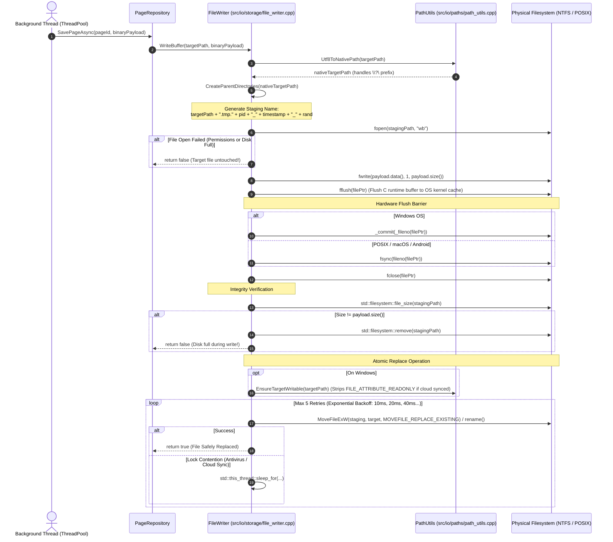
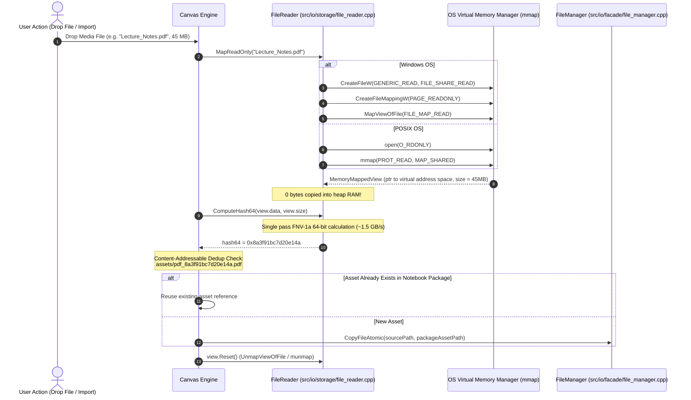
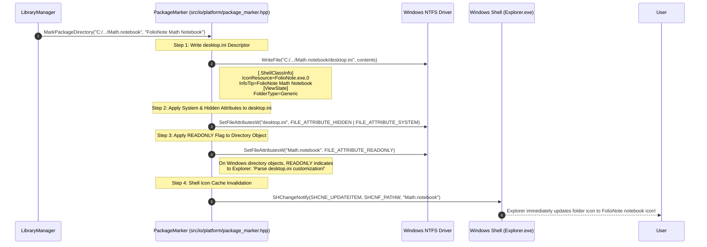
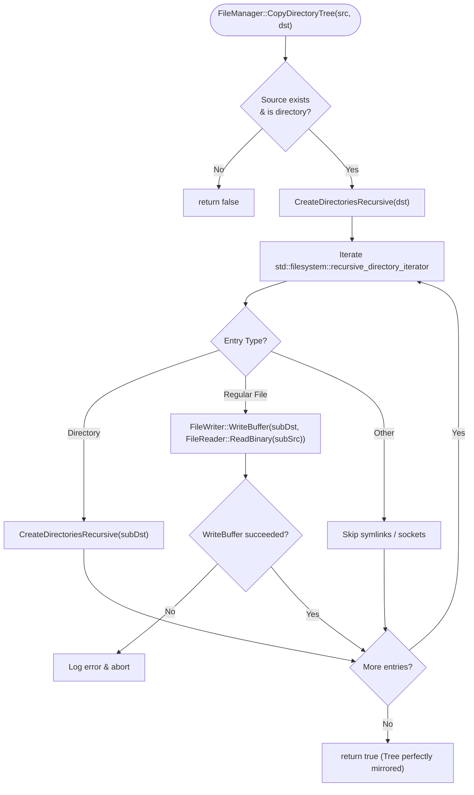

# FolioNote I/O & User Data Persistence Workflow Specification

> **Module:** `src/io/`  
> **Subsystem Classification:** Hardware Storage Abstraction & Critical Persistence Pipeline  
> **Target Audience:** Engine Core Developers, Security Auditors, Platform Engineers  
> **Primary Directive:** Absolute Data Protection, Crash Resilience, and Zero In-Place Overwrites

---

## 1. Executive Summary & Purpose

The `src/io/` subsystem is the most mission-critical component of the FolioNote application runtime. While rendering, UI animations, and vector rasterization can be reconstructed if interrupted, **user data written to storage cannot be recovered if corrupted**.

FolioNote operates as a **local-first, package-based digital notebook system**. Each notebook is stored as an on-disk folder package (`.notebook`) housing SQLite databases, binary vector strokes (`.ink`), JSON manifests, and external multimedia attachments. 

This document details the operational workflows, multi-threaded safety invariants, error recovery protocols, and platform integration pipelines implemented across the `src/io/` module.

---

## 2. Global Architecture & Pipeline Topology

The I/O subsystem sits between the domain persistence coordinators and the native operating system kernels:

---

## 3. Operational Workflows

### 3.1 Workflow 1: Crash-Resilient Page Persistence (`.ink`)

This workflow governs how handwritten strokes and page metadata are persisted from memory onto disk without risk of truncation.

---

### 3.2 Workflow 2: Zero-Copy Asset Ingestion & Content-Addressable Storage

When importing large images, background PDF documents, or audio clips, the application ingests files without memory duplication:

---

### 3.3 Workflow 3: Notebook Directory Package Branding (`PackageMarker`)

In FolioNote, `.notebook` folders must appear as genuine application notebooks in the Windows Shell rather than standard yellow folders.

---

### 3.4 Workflow 4: Recursive Safe Directory Tree Cloning & Moves

When a user duplicates a notebook or restores a backup snapshot, `FileManager::CopyDirectoryTree` ensures deep recursive duplication with conflict avoidance:

---

## 4. Concurrency & Multi-Thread Safety Model

| Component | Concurrency Guarantee | Synchronization Mechanism | Thread Safety Rules |
| :--- | :--- | :--- | :--- |
| `PathUtils` | **Thread-Safe & Reentrant** | None (Pure Stateless Functions) | Operates strictly on function parameters and local stack frames. Can be called simultaneously from hundreds of threads. |
| `AppDirectories` | **Thread-Safe** | `std::mutex s_packageRootMutex`, `std::mutex s_appRootMutex` | Setting or querying global roots or active package assets is protected by fine-grained mutexes. |
| `FileWriter` | **Thread-Safe** | Process & Thread Unique Staging File Tokens | Each atomic write generates a unique staging path incorporating process ID, thread ID, monotonic timestamp, and random numbers. Concurrent writes to *distinct* files proceed in parallel without locking. Concurrent writes to the *same* file are resolved by OS atomic swap serialization. |
| `FileReader` | **Thread-Safe & Lock-Free** | OS File Mapping Share Mode (`FILE_SHARE_READ`) | Multiple threads can simultaneously memory-map or read the same file on disk without contention. |
| `FileLogger` | **Thread-Safe** | `std::mutex m_mutex` | Log entry formatting, size tracking, rotation checks, and in-memory ring-buffer pushes are fully synchronized. |
| `SystemDialogs` | **Main Thread Only** | OS UI Thread Requirement | Native OS modal file dialogs (`GetOpenFileNameW`, AppleScript, Zenity) pump OS event loops and must only be invoked from the application's primary UI thread. |

---

## 5. Threat Modeling & Failure Mode Recovery

### 5.1 Scenario 1: Power Loss / Kernel Panic During Save
- **Threat:** User loses laptop battery or power cord is pulled while writing a 12 MB notebook vector drawing.
- **Handling:** The payload was being written to `.tmp.7142_1728518400_89211`. The original `page.ink` has not been touched. Upon reboot, FolioNote loads the untouched pre-save `page.ink`. The orphan `.tmp` file is cleaned up during the next startup cache sweep. Zero data corruption.

### 5.2 Scenario 2: Antivirus or Cloud Storage (OneDrive / Dropbox) Lock Contention
- **Threat:** When FolioNote writes a file inside a OneDrive folder, OneDrive's file-system filter driver momentarily locks the file with `FILE_SHARE_READ` to compute an SHA-256 hash. `MoveFileExW` fails with `ERROR_ACCESS_DENIED`.
- **Handling:** `FileWriter` detects the transient lock and enters an exponential backoff loop, retrying up to 5 times (total backoff window ~310 ms). The lock releases and the rename succeeds transparently without surfacing an error modal to the user.

### 5.3 Scenario 3: Destination File Marked `FILE_ATTRIBUTE_READONLY`
- **Threat:** Cloud-synced files or files cloned from Git frequently retain the NTFS read-only attribute bit. Win32 `MoveFileExW(..., MOVEFILE_REPLACE_EXISTING)` fails to overwrite read-only files.
- **Handling:** `PathUtils::EnsureTargetWritable()` queries file attributes and strips `FILE_ATTRIBUTE_READONLY` immediately prior to the rename call.

### 5.4 Scenario 4: Deep Directory Nesting Exceeding 260 Characters
- **Threat:** Deeply nested notebooks and UUID section hierarchies exceed the Win32 `MAX_PATH` limit of 260 characters.
- **Handling:** `PathUtils::Utf8ToNativePath` detects long paths ($\ge 240$ chars) and transforms the path into an NT kernel canonical extended-length path (`\\?\C:\...`), supporting paths up to 32,767 characters.

---

## 6. Subsystem Verification & Test Matrix

The I/O subsystem is validated through automated test suites in `test/`:

1. **`test_file_manager`:** Validates path normalization, directory enumeration, recursive copying, folder moving, and path equivalence across edge cases.
2. **`test_file_saver`:** Validates crash-resilient atomic writes, byte-for-byte fidelity, parent directory creation, and non-destructive overwrite behavior.
3. **`test_storage`:** Validates SQLite database storage and integration with `PageRepository` and `BinarySerializer`.
