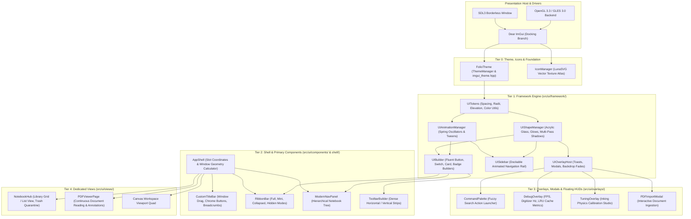
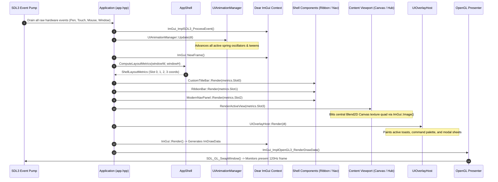

# FolioNote UI Subsystem Architecture & Workflow Reference

> **Document Location:** `src/ui/WORKFLOW.md`  
> **Version:** 2.0 (Modern Declarative Component Framework & Presentation Architecture)  
> **Target Framework:** C++20, Dear ImGui (Docking), SDL3, OpenGL 3.3 / GLES 3.0, LunaSVG, FreeType 2  
> **Future Evolution Target:** Standalone Application-Building UI Framework / SDK (`FolioUI`)

---

## Table of Contents

1. [System Vision & Standalone Framework Roadmap](#1-system-vision--standalone-framework-roadmap)
2. [High-Level Architecture & Layered Hierarchy](#2-high-level-architecture--layered-hierarchy)
3. [Complete UI Source Tree Outline](#3-complete-ui-source-tree-outline)
4. [End-to-End Frame Orchestration & Presentation Lifecycle](#4-end-to-end-frame-orchestration--presentation-lifecycle)
5. [The Framework Engine (`src/ui/framework/`)](#5-the-framework-engine-srcuiframework)
   - [5.1 Design Tokens & Elevation Hierarchy (`ui_tokens.hpp`)](#51-design-tokens--elevation-hierarchy-ui_tokenshpp)
   - [5.2 Dynamic Physics Animation Engine (`ui_animation_manager.hpp`)](#52-dynamic-physics-animation-engine-ui_animation_managerhpp)
   - [5.3 Surface Primitives & Glassmorphic Shapes (`ui_shape_manager.hpp`)](#53-surface-primitives--glassmorphic-shapes-ui_shape_managerhpp)
   - [5.4 Fluent Declarative Widget Builders (`ui_builder.hpp`)](#54-fluent-declarative-widget-builders-ui_builderhpp)
   - [5.5 Animated Responsive Sidebar Rail (`ui_sidebar.hpp`)](#55-animated-responsive-sidebar-rail-ui_sidebarhpp)
   - [5.6 Global Overlay, Modal & Toast Host (`ui_overlay_host.hpp`)](#56-global-overlay-modal--toast-host-ui_overlay_hosthpp)
6. [Component Layer & Shell Orchestration](#6-component-layer--shell-orchestration)
   - [6.1 Window Shell Geometry Calculator (`app_shell.hpp`)](#61-window-shell-geometry-calculator-app_shellhpp)
   - [6.2 Custom Borderless TitleBar (`custom_titlebar.hpp`)](#62-custom-borderless-titlebar-custom_titlebarhpp)
   - [6.3 Office 365-Style Ribbon Bar (`ribbon_bar.hpp`)](#63-office-365-style-ribbon-bar-ribbon_barhpp)
   - [6.4 Hierarchical Navigation Drawer (`modern_nav_panel.hpp`)](#64-hierarchical-navigation-drawer-modern_nav_panelhpp)
   - [6.5 Dense Toolbar Factory (`toolbar_builder.hpp`)](#65-dense-toolbar-factory-toolbar_builderhpp)
7. [Overlays, Diagnostics & Modals (`src/ui/overlays/`)](#7-overlays-diagnostics--modals-srcuioverlays)
   - [7.1 Command Palette (`command_palette.hpp`)](#71-command-palette-command_palettehpp)
   - [7.2 Real-Time Telemetry HUD (`debug_overlay.hpp`)](#72-real-time-telemetry-hud-debug_overlayhpp)
   - [7.3 Live Inking Physics Studio (`tuning_overlay.hpp`)](#73-live-inking-physics-studio-tuning_overlayhpp)
   - [7.4 External PDF Import Modal (`pdf_import_modal.hpp`)](#74-external-pdf-import-modal-pdf_import_modalhpp)
8. [Dedicated Application Views (`src/ui/views/`)](#8-dedicated-application-views-srcuiviews)
   - [8.1 Notebook Hub (`notebook_hub.hpp`)](#81-notebook-hub-notebook_hubhpp)
   - [8.2 Standalone Continuous PDF Viewer (`pdf_viewer_page.hpp`)](#82-standalone-continuous-pdf-viewer-pdf_viewer_pagehpp)
9. [Vector Icon Engine & Typography Pipeline](#9-vector-icon-engine--typography-pipeline)
10. [Mathematical Foundations & Visual Algorithms](#10-mathematical-foundations--visual-algorithms)
    - [10.1 Second-Order Damped Spring Oscillator Physics](#101-second-order-damped-spring-oscillator-physics)
    - [10.2 Frame-Rate Independent Exponential Decay Transitions](#102-frame-rate-independent-exponential-decay-transitions)
    - [10.3 Multi-Pass Drop Shadow & Acrylic Specular Edge Math](#103-multi-pass-drop-shadow--acrylic-specular-edge-math)
11. [Decoupling Blueprint: Standalone API Extraction Strategy](#11-decoupling-blueprint-standalone-api-extraction-strategy)

---

## 1. System Vision & Standalone Framework Roadmap

FolioNote's user interface is constructed as a modern, declarative, physics-animated desktop UI engine on top of **Dear ImGui**. 

### The Extraction Objective
Currently integrated within `src/ui/`, this subsystem is intentionally designed with strict layer boundaries so it can be extracted into an independent, open-source C++ application UI framework (provisionally named **`FolioUI`**). 

```
┌────────────────────────────────────────────────────────────────────────┐
│                        STANDALONE "FolioUI" SDK                        │
│ ┌──────────────────┐ ┌──────────────────┐ ┌──────────────────────────┐ │
│ │ Design Tokens    │ │ Physics Springs  │ │ Glass & Shadow Shapes    │ │
│ │ (ui_tokens.hpp)  │ │ (ui_animation)   │ │ (ui_shape_manager)       │ │
│ └──────────────────┘ └──────────────────┘ └──────────────────────────┘ │
│ ┌──────────────────┐ ┌──────────────────┐ ┌──────────────────────────┐ │
│ │ Fluent Builders  │ │ Dockable Sidebar │ │ Overlays & Toasts Host   │ │
│ │ (ui_builder)     │ │ (ui_sidebar)     │ │ (ui_overlay_host)        │ │
│ └──────────────────┘ └──────────────────┘ └──────────────────────────┘ │
│ ┌──────────────────┐ ┌──────────────────┐ ┌──────────────────────────┐ │
│ │ Office Ribbon    │ │ Borderless Shell │ │ Command Palette HUD      │ │
│ │ (ribbon_bar)     │ │ (app_shell)      │ │ (command_palette)        │ │
│ └──────────────────┘ └──────────────────┘ └──────────────────────────┘ │
└────────────────────────────────────┬───────────────────────────────────┘
                                     │ Linked by Multiple Applications
                ┌────────────────────┴────────────────────┐
                ▼                                         ▼
      ┌──────────────────┐                      ┌──────────────────┐
      │    FolioNote     │                      │  Third-Party App │
      │ (Digital Inking) │                      │ (CAD / Markdown) │
      └──────────────────┘                      └──────────────────┘
```

### Core Design Rules Supporting Future Extraction:
1. **Zero Hardcoded Domain Coupling:** UI components never reference `CanvasEngine`, `DocumentSession`, or `PageRepository` directly. Instead, all mutations flow through standard action callbacks (`std::function<void()>`), observer notifications, or data transfer structs (DTOs).
2. **Texture-Agnostic Central Viewport:** The application shell treats the main document viewing area as an abstract render surface identified solely by an `ImTextureID` quad and viewport coordinates.
3. **Pure Immediate-Mode Ergonomics with Retained Animation State:** Combines the simplicity of ImGui's immediate execution with persistent, ID-keyed physics oscillators for state transitions.

---

## 2. High-Level Architecture & Layered Hierarchy

The UI system is decomposed into five distinct tiers:



---

## 3. Complete UI Source Tree Outline

```
src/ui/
├── icon_manager.hpp                      # Vector SVG parsing via LunaSVG, texture atlas generation
├── imgui_theme.hpp                       # FolioTheme tokens, font definitions, dark/light color schemes
├── WORKFLOW.md                           # Master UI architecture and workflow specification (this file)
│
├── framework/                            # Modern declarative, physics-animated UI framework core
│   ├── README.md                         # Framework subsystem documentation and token reference
│   ├── ui_tokens.hpp                     # Design tokens: Spacing (xs-xxl), Radii (sm-pill), Elevation (Flat-Modal)
│   ├── ui_animation_manager.hpp / .cpp   # Spring-damper physics oscillators and frame-rate independent tweens
│   ├── ui_shape_manager.hpp / .cpp       # Acrylic glassmorphism, multi-pass blurred drop shadows, border glows
│   ├── ui_builder.hpp / .cpp             # Fluent widget builders: Button, Switch, Card, Badge, SegmentedControl
│   ├── ui_sidebar.hpp / .cpp             # Responsive, animated dockable sidebar with spring transitions
│   └── ui_overlay_host.hpp / .cpp        # Global toast notification queue and modal overlay host
│
├── shell/                                # Window chrome and master layout geometry
│   └── app_shell.hpp / .cpp              # 4-slot layout calculator (TitleBar, Ribbon, Sidebar, Viewport)
│
├── components/                           # High-level composable desktop components
│   ├── custom_titlebar.hpp               # Custom borderless titlebar, window buttons, and breadcrumb path
│   ├── dialogs.hpp                       # Standard confirmation modals, rename prompts, delete warnings
│   ├── modern_nav_panel.hpp              # Multi-tier tree: Library -> Notebook -> Group -> Section -> Page
│   ├── notebook_nav.hpp                  # Quick section tab bar with drag-to-reorder tab strips
│   ├── ribbon_bar.hpp                    # Office 365-style Ribbon toolbar (Home, Draw, Insert, Review, View)
│   ├── text_container_view.hpp           # In-place rich text editing container with floating formatting bar
│   └── toolbar_builder.hpp / .cpp        # High-density vertical and horizontal tool strips
│
├── overlays/                             # Floating HUDs, tool pickers, and calibration overlays
│   ├── command_palette.hpp / .cpp        # Global quick-action search and command launcher (Ctrl+Shift+P)
│   ├── debug_overlay.hpp                 # Real-time telemetry HUD: FPS, input rate, frame time, LRU stats
│   ├── overlay_manager.hpp / .cpp        # Overlay stacking order, modal focus capture, and hit-test routing
│   ├── pdf_import_modal.hpp              # Interactive multi-page PDF import and canvas placement dialog
│   ├── toolbar_demo_overlay.hpp          # Interactive design sandbox for testing ribbon styles and tokens
│   └── tuning_overlay.hpp                # Live inking physics tuning studio (mass, stiffness, damping preview)
│
└── views/                                # Full-screen primary application views
    ├── notebook_hub.hpp                  # Fullscreen notebook hub: library cards, templates, recycle bin
    └── pdf_viewer_page.hpp               # Dedicated continuous document reader for textbooks and papers
```

---

## 4. End-to-End Frame Orchestration & Presentation Lifecycle

FolioNote runs an adaptive **120 Hz / 60 Hz** presentation loop paced by SDL3 and hardware display v-sync:



---

## 5. The Framework Engine (`src/ui/framework/`)

The framework layer provides standardized tokens, physics-driven animations, glassmorphic rendering, and fluent builders.

### 5.1 Design Tokens & Elevation Hierarchy (`ui_tokens.hpp`)

Eliminates magic numbers by centralizing spatial metrics and color math:

#### Spacing Tokens:
- `Spacing::xs` = $4\text{ px}$
- `Spacing::sm` = $8\text{ px}$
- `Spacing::md` = $12\text{ px}$
- `Spacing::lg` = $16\text{ px}$
- `Spacing::xl` = $24\text{ px}$
- `Spacing::xxl` = $32\text{ px}$

#### Corner Radii:
- `Radius::none` = $0\text{ px}$
- `Radius::xs` = $3\text{ px}$
- `Radius::sm` = $6\text{ px}$
- `Radius::md` = $10\text{ px}$
- `Radius::lg` = $16\text{ px}$
- `Radius::pill` = $9999\text{ px}$

#### Elevation Levels:
- **`Elevation::Flat`**: Zero shadow offset.
- **`Elevation::Raised`**: $y\text{-offset} = 2\text{ px}$, $\text{blur} = 4\text{ px}$, opacity $12\%$. Used for standard secondary buttons and cards.
- **`Elevation::Floating`**: $y\text{-offset} = 6\text{ px}$, $\text{blur} = 16\text{ px}$, $\text{spread} = 2\text{ px}$, opacity $18\%$. Used for toolbars and dropdowns.
- **`Elevation::Modal`**: $y\text{-offset} = 16\text{ px}$, $\text{blur} = 36\text{ px}$, $\text{spread} = 4\text{ px}$, opacity $28\%$. Used for command palettes and modal dialogs.

---

### 5.2 Dynamic Physics Animation Engine (`ui_animation_manager.hpp`)

Raw ImGui evaluates immediately each frame, ordinarily causing abrupt layout snaps. `UIAnimationManager` introduces frame-rate independent interpolation:

```cpp
// 1. Interaction Alpha Tracking (Hover/Press transition)
float hoverAlpha = UIAnimationManager::Get().GetInteractionAlpha(widgetId, isHovered, isPressed);

// 2. Spring Simulation (Tactile badges, accordion heights)
float currentX = UIAnimationManager::Get().GetSpringValue("sidebar_width", targetWidth, mass, stiffness, damping);

// 3. Exponential Decay (Smooth camera glide, opacity fades)
float currentVal = UIAnimationManager::Get().GetDecayValue("fade_overlay", targetVal, lambda);
```

---

### 5.3 Surface Primitives & Glassmorphic Shapes (`ui_shape_manager.hpp`)

Renders modern visual surfaces directly into Dear ImGui `ImDrawList`:

1. **Multi-Pass Blurred Drop Shadows (`DrawShadow`):** Simulates natural Gaussian diffusion by drawing 3–5 concentric concentric rounded rectangles with exponentially decaying alpha values.
2. **Acrylic Glass Surfaces (`DrawAcrylicSurface`):** Renders a translucent background with a crisp $1\text{ px}$ semi-transparent specular line across the top edge (`0xFFFFFFFF` at $15\%$ opacity), giving an authentic glass reflection.
3. **Accent Glows (`DrawGlow`):** Renders soft colored highlights around active focus elements or primary action buttons.

---

### 5.4 Fluent Declarative Widget Builders (`ui_builder.hpp`)

Eliminates hundreds of lines of boilerplate button and card code:

```cpp
// Fluent Action Button with variant, size, icon, and spring animation
bool clicked = Button("Save Document")
    .Variant(UIButtonVariant::Primary)
    .Size(UIButtonSize::Medium)
    .Icon("save_icon")
    .Badge("Ctrl+S")
    .Tooltip("Persist all notebook changes to disk")
    .Build();

// Animated Toggle Switch
bool toggleChanged = Switch("Dark Mode", &isDarkMode)
    .Variant(UISwitchVariant::Primary)
    .Tooltip("Toggle global application theme")
    .Build();

// Glassmorphic Content Card
Card("export_settings_card")
    .Variant(UICardVariant::Glassmorphic)
    .Elevation(Elevation::Floating)
    .Padding(Spacing::md)
    .Content([&]() {
        ImGui::Text("Export Options");
    })
    .Build();
```

---

### 5.5 Animated Responsive Sidebar Rail (`ui_sidebar.hpp`)

- Renders an icon-based vertical navigation rail that expands into a full hierarchical panel.
- Powered by `SpringState` physics, expanding and collapsing with silky, non-linear easing.
- Supports badged action items, tooltips, search filters, and footer buttons.

---

### 5.6 Global Overlay, Modal & Toast Host (`ui_overlay_host.hpp`)

- **Toast Notifications Queue:** Thread-safe asynchronous toast queue (`PushToast(ToastType::Success, "Saved", "Page saved successfully")`) rendered in the bottom-right corner with auto-dismiss progress bars.
- **Modal Sheets:** Centers dialogs over a darkened, blurred backdrop fade.

---

## 6. Component Layer & Shell Orchestration

### 6.1 Window Shell Geometry Calculator (`app_shell.hpp`)

`AppShell` partitions the window into deterministic coordinate zones based on current display settings:

```
┌────────────────────────────────────────────────────────────────────────┐
│ Slot 0: Custom TitleBar (Minimize, Maximize, Close, Breadcrumbs)       │
├────────────────────────────────────────────────────────────────────────┤
│ Slot 1: Ribbon Bar (Full / Mini / Collapsed / Hidden)                  │
├───────────────┬────────────────────────────────────────────────────────┤
│ Slot 2:       │ Slot 3: Primary Content Viewport                       │
│ Navigation    │ (Central Canvas / PDF Viewer / Notebook Hub)           │
│ Sidebar Rail  │                                                        │
│ (Dynamic W)   │ (Fills exact remainder of logical screen coordinates)  │
│               │                                                        │
└───────────────┴────────────────────────────────────────────────────────┘
```

#### Ribbon Display Modes:
1. **`Full`**: Standard desktop ribbon with category tabs and multi-row action panels ($136\text{ px}$).
2. **`Mini`**: Compact single-row toolbar for tablet or high-density usage ($52\text{ px}$).
3. **`Collapsed`**: Only category tab headers visible ($38\text{ px}$). Clicking a tab temporarily floats the ribbon overlay.
4. **`Hidden`**: Maximum drawing surface ($0\text{ px}$). A floating pull-tab indicator appears at the top center to reveal the ribbon on demand.

---

### 6.2 Custom Borderless TitleBar (`custom_titlebar.hpp`)
- Replaces standard OS window chrome with an immersive branded header.
- Integrates window drag regions (`SDL_SetWindowHitTest`), document title breadcrumbs (*"Computer Science / Lecture 4 / Page 12"*), and native minimize/maximize/close buttons.

### 6.3 Office 365-Style Ribbon Bar (`ribbon_bar.hpp`)
- Organizes features into contextual tabs: **Home**, **Draw**, **Insert**, **History**, **Review**, **View**.
- Houses pen galleries with live color chips, stroke thickness flyouts, shape selectors, and export buttons.

### 6.4 Hierarchical Navigation Drawer (`modern_nav_panel.hpp`)
- Implements smooth multi-column tree navigation:
  $$\text{Library} \longrightarrow \text{Notebooks} \longrightarrow \text{Section Groups} \longrightarrow \text{Sections} \longrightarrow \text{Pages \& Subpages}$$
- Supports drag-and-drop tab reordering, inline renaming, color tag selection, and soft-delete trash operations.

---

## 7. Overlays, Diagnostics & Modals (`src/ui/overlays/`)

### 7.1 Command Palette (`command_palette.hpp`)
- Activated via `Ctrl+Shift+P` or titlebar search.
- Provides fuzzy matching across all application commands, tools, open notebooks, and recent pages with instant keyboard navigation (`Up`, `Down`, `Enter`, `Esc`).

### 7.2 Real-Time Telemetry HUD (`debug_overlay.hpp`)
- Renders live diagnostic graphs:
  - Render frame rate (FPS) and presentation latency ($\text{ms}$).
  - Hardware digitizer ingestion rate ($240\text{--}480\text{ Hz}$).
  - Spatial R-Tree node count and frustum culling query latency.
  - PageRepository LRU memory working set and RAM consumption.

### 7.3 Live Inking Physics Studio (`tuning_overlay.hpp`)
- Interactive real-time calibration sandbox for pen dynamics.
- Exposes sliders for mass ($m$), spring stiffness ($k$), and damping ($c$), rendering test strokes side-by-side to allow visual tuning.

### 7.4 External PDF Import Modal (`pdf_import_modal.hpp`)
- Displays multi-page thumbnail previews when a user prints or imports an external PDF.
- Allows selective page extraction, split section placement, or direct insertion into the active canvas.

---

## 8. Dedicated Application Views (`src/ui/views/`)

### 8.1 Notebook Hub (`notebook_hub.hpp`)
- Fullscreen dashboard displayed when no document is active or when switching libraries.
- Features card grids of recent notebooks, creation templates, storage statistics, and the recycle bin quarantine.

### 8.2 Standalone Continuous PDF Viewer (`pdf_viewer_page.hpp`)
- Specialized high-efficiency reader designed for multi-hundred-page textbooks and academic papers.
- Powered by Google PDFium with continuous virtualized page scrolling, text selection, and annotation overlays.

---

## 9. Vector Icon Engine & Typography Pipeline

### Vector Icon Cache (`icon_manager.hpp`)
- FolioNote uses resolution-independent SVG icons rendered via **LunaSVG** and **PlutoVG**.
- **Texture Atlas Mechanism:** On application startup or DPI changes, SVGs in `assets/icons/` are rasterized at the exact physical display scale and packed into an OpenGL texture atlas. Icons render with crisp subpixel clarity at any zoom factor ($100\%$, $150\%$, $200\%$, $300\%$).

### Typography Engine
- Typography is loaded through **FreeType 2** with subpixel anti-aliasing.
- The font atlas supports multiple size tiers: Body ($14\text{ pt}$), Heading ($18\text{ pt}$), Display ($24\text{ pt}$), and Code ($13\text{ pt}$).

---

## 10. Mathematical Foundations & Visual Algorithms

### 10.1 Second-Order Damped Spring Oscillator Physics

Hover badges, sidebar slides, and button clicks use second-order harmonic oscillators:

$$m \frac{d^2 x}{dt^2} + c \frac{dx}{dt} + k (x - x_{\text{target}}) = 0$$

Dividing by mass $m$:
$$\ddot{x} + 2 \zeta \omega_n \dot{x} + \omega_n^2 (x - x_{\text{target}}) = 0$$

Where:
- $\omega_n = \sqrt{k / m}$ is the natural angular frequency.
- $\zeta = \frac{c}{2 \sqrt{km}}$ is the damping ratio.

#### Critical Damping Formulation ($\zeta = 1$):
When critically damped, the system achieves the fastest possible transition without overshoot. Given initial displacement $x_0 = x(0) - x_{\text{target}}$ and initial velocity $v_0 = \dot{x}(0)$:

$$x(t) = x_{\text{target}} + (x_0 + (v_0 + \omega_n x_0)t) e^{-\omega_n t}$$
$$\dot{x}(t) = (v_0 - \omega_n (x_0 + (v_0 + \omega_n x_0)t)) e^{-\omega_n t}$$

This exact analytical solution is evaluated per frame in `UIAnimationManager::UpdateSpring()`.

---

### 10.2 Frame-Rate Independent Exponential Decay Transitions

For continuous transitions (such as opacity fades or smooth camera tracking), linear interpolation (`lerp`) dependent on fixed time increments produces stutter on variable frame rates. FolioNote employs frame-rate independent exponential decay:

$$x(t + \Delta t) = x_{\text{target}} + (x(t) - x_{\text{target}}) e^{-\lambda \Delta t}$$

Where $\lambda > 0$ represents the decay rate constant. As $\Delta t \to \infty$, $x \to x_{\text{target}}$ smoothly regardless of whether the frame took $8.3\text{ ms}$ ($120\text{ Hz}$) or $16.6\text{ ms}$ ($60\text{ Hz}$).

---

### 10.3 Multi-Pass Drop Shadow & Acrylic Specular Edge Math

#### Drop Shadow Gaussian Emulation:
Real-time Gaussian blurs are computationally expensive. `UIShapeManager::DrawShadow()` approximates a Gaussian blur by accumulating $N$ concentric rounded rectangles:

$$\alpha_i = \alpha_{\text{base}} \cdot \left(1 - \frac{i}{N}\right)^2, \quad \text{expansion}_i = \text{spread} + \text{blur} \cdot \left(\frac{i}{N}\right)$$

#### Acrylic Specular Reflection:
To create the perception of physical depth and specular lighting on glassmorphic panels:
1. The background is rendered with a translucent tinted fill: $\text{RGBA}(R, G, B, \alpha_{\text{glass}})$.
2. An inset $1\text{ px}$ line is rendered along the top edge:
   $$y_1 = y_0 + 1, \quad \text{Color} = \text{RGBA}(255, 255, 255, 0.15)$$
3. The bottom border is darkened slightly to simulate ground ambient occlusion:
   $$y_2 = y_{\text{bottom}} - 1, \quad \text{Color} = \text{RGBA}(0, 0, 0, 0.20)$$

---

## 11. Decoupling Blueprint: Standalone API Extraction Strategy

When moving this UI system into a standalone repository (`FolioUI`), the following interface contract should be established:

```cpp
#include <folioui/folioui.hpp>

int main() {
    // 1. Initialize standalone UI context with host backend
    FolioUI::Config config;
    config.theme = FolioUI::ThemeMode::Dark;
    config.enableAnimations = true;
    FolioUI::Context ui(config);

    // 2. Register application-level callbacks & navigation providers
    ui.SetDocumentTitleProvider([]() { return "My Custom Editor / Untitled"; });
    ui.SetCommandPaletteProvider([](const std::string& query) {
        return SearchMyCommands(query);
    });

    // 3. Define ribbon layout declaratively
    ui.Ribbon().AddTab("File")
        .AddGroup("Project")
            .AddButton("New", Icons::NewDoc, []() { CreateNew(); })
            .AddButton("Open", Icons::Folder, []() { OpenFile(); });

    // 4. Render loop
    while (running) {
        ui.NewFrame(deltaTime);

        // Shell hosts arbitrary central render quad (OpenGL texture ID)
        ui.RenderShell([&](ImTextureID& viewportTexture, ImVec2 viewportSize) {
            viewportTexture = MyEngine::RenderViewport(viewportSize.x, viewportSize.y);
        });

        ui.EndFrame();
    }
}
```

### Key Milestones for Separation:
1. **Module Packaging:** Move `src/ui/framework/`, `src/ui/shell/`, and `src/ui/components/` into `folioui/include` and `folioui/src`.
2. **Abstract Document Adapter:** Replace `DocumentSession` references in `modern_nav_panel.hpp` with a generic `ITreeNavigationProvider` interface.
3. **Standalone CMake Target:** Create `add_library(folioui STATIC ...)` linking only to `imgui`, `lunasvg`, and `freetype`, with zero dependencies on FolioNote's storage or document models.
